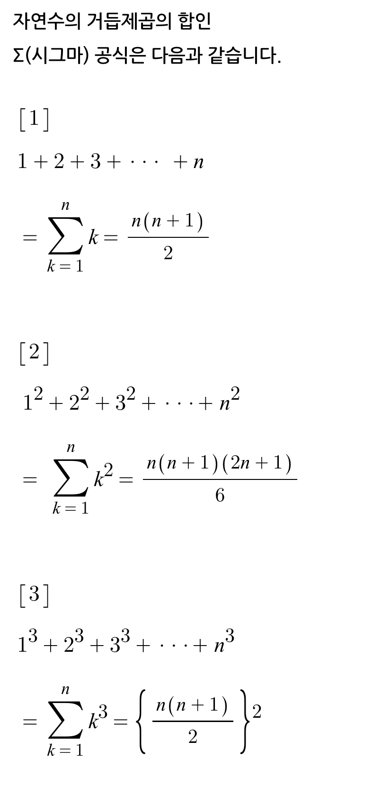
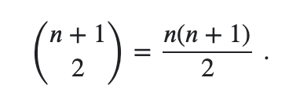
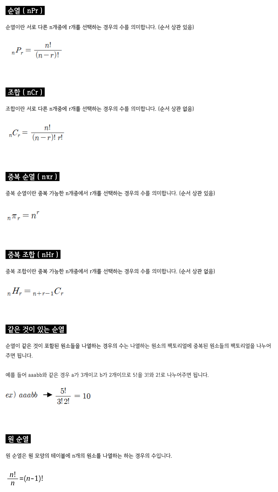
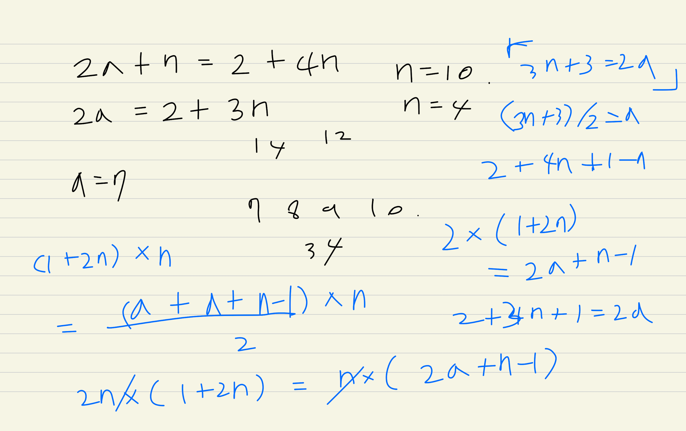
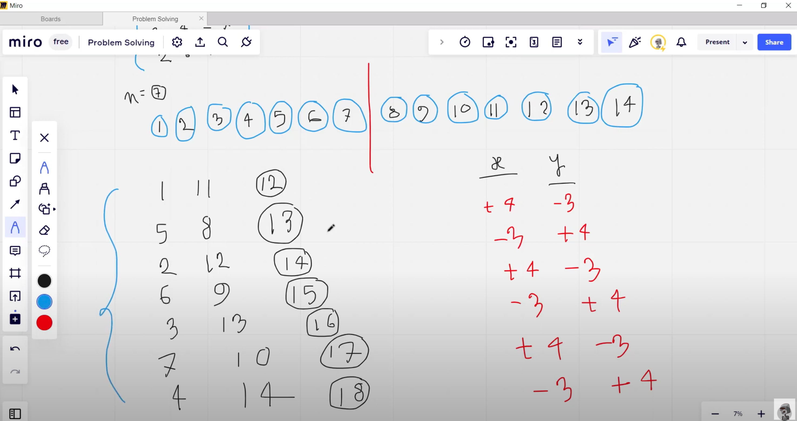

# Codeforces


## (20221227) Codeforces Round #841 (Div. 2) and Divide by Zero 2022
> https://codeforces.com/contest/1731

### A. Joey Takes Money

두수를 더한 수보다 두수를 곱한수가 무조건 더 크다

한쪽에 두수를 곱한수를 모으고, 다른수는 1로 swap한다

그렇다면 모든 수를 곱한 뒤에 다른 1들의 수를 계산하면 된다

### B. Kill Demodogs

가야하는 경로는 확실하다.
오른,아래,오른,아래...로 가는 것이 최선

(1 * 1) + (1 * 2) + (2 * 2) + (2 * 3) + (3 * 3) + (3 * 4) ...

보면 뭔가 수가 반복되고 제곱수들이 끼어있다

이걸 수식으로 좀 정리해보면...

1 + (1+2)* 2 + (2+3)* 3 + (3+4)* 4 ...

1 + (3)* 2 + (5)* 3 + (7)* 4 ...

일반화시키면

1 + sum((2N-1)* N))[2:4] ...

2N^2-N 의 시그마인데...

> 제곱수의 시그마 공식이 있을까? 있다

{width="300" height="550"}


### C. Even Subarrays

해결해야하는 과정들이 많다

1. 구간을 어떻게 특정할 것인가? i~j 까지의 연속되는 부분집합을 고르는 문제는 O(N^2)
2. 부분집합을 결정해도 부분 XOR sum 을 구하는데 i~j 까지 순회가 필요 O(N)
3. 약수가 짝수개인지를 어떻게 판별하나 -> ??

일단 1번 문제는 지나가고...
2번 문제는 부분합 prefix_sum 으로 해결 가능하다. O(1)

i~j 까지의 XOR Sum은 0~j까지의 XOR Sum 과 0~i까지의 XOR Sum을 다시 XOR 한 것과 같다

3번 문제. 약수가 짝수개인것은 약수 개수의 특성에서 알수 있다 O(1)

> 약수의 개수는 소인수분해하였을때, 각 소인수의 지수에 1을 더한 수들의 곱이다

> 또한 제곱수의 약수의 개수는 홀수. 제곱수가 아닌 수는 짝수개이다

따라서 특정 구간의 XOR Sum이 제곱수가 아니라면 짝수개가 아니다


그렇다면 1번 문제는 어떻게 해결 가능할까

* step1

이런 문제에서는 보통 반대로 생각하는게 좋은데, 그게 잘 안된다

탐색 순서가 i가 되었을때, 그 이후에 가능한 j를 선택하려고 하지말고,

탐색 순서가 j가 되었을때..j가 되었다는 말은 가능한 i들을 모두 지나왔다는 뜻이니깐 어떻게든 데이터가 있다

또한 제곱수가 아닌수(약수의 개수가 짝수)인 수보다 제곱수인 수를 찾는게 훨씬 쉽다(약수의 개수가 홀수)

따라서 "전체 부분집합의 수에서 XOR Sum이 제곱수가 되는 부분집합의 수를 빼주자"라는 문제로 일반화시킬 수 있다

> the-total-number-of-subarrays. nC2 + nC1 = (n+1) C 2 = n(n+1)/2

{width="250" height="80"}


* step2

탐색 순서가 j가 되었을때. i를 처음부터 모든 index에서 탐색해야할까? 그렇다면 O(N^2)
탐색 횟수를 줄이려면 어떻게 해야할까?

중요한것은 "0~i까지의 XOR Sum을 다시 XOR"하는 것이다

하지만 어떠한 i에 대해서는 수행할 필요가 없다. 어떤 0~i까지의 XOR Sum이 필요할까?
XOR Sum이 제곱수가 되는 i가 필요하다
그러한 XOR Sum이 j 이전에 몇개나 있었는지를 저장해오면서 탐색을 하면된다

"0~i까지의 XOR Sum이 제곱수라면 저장해둔다"
-> "0~i까지의 XOR Sum을 모두 저장해두고 그 중에서 제곱수에 해당하는 것만 순회하면서 개수를 세어준다"


이렇게 i부터 생각해서 j를 결정하는 것은 어렵다
j까지 탐색해오면서 뭔가 데이터를 쌓아두고 활용하는 것, 혹은 모든 이전 i를 탐색하는게 아니라 범위를 조정할 수 있다면 시간 복잡도를 줄일 수 있다


* step3

가능한 완전제곱수를 미리 구해두자. 어느 범위까지 미리 구해두어야할까?

8 -> 1000(2) 이다

0111(2)가 XOR 되면 1111(2)까지 가능하다. 이는 8보다 크다

그렇다면 일반적으로 N에 XOR 연산을 수행했을때 2N보다 커질수는 없다 (좌우 쉬프트 연산을 1번씩 해보면 이해가능)

0,1,4,9,16 .... 2N

그렇다면 완전 제곱수를 미리 구하는 순회는 0~sqrt(2N) 까지 수행하면 된다. O(sqrt(2N))


시작할때 0 xor sum의 카운트도 +1 해줘야 한다는 것을 잊으면 안된다


시간복잡도는 O(N * sqrt(N))

N = 10^5

N * sqrt(N) -> 10^7

제한시간안에 수행가능
이때 몇가지 팁은..

* recursive -> iteration
* long long -> integer
* map -> array


### D. Valiant's New Map

matrix에서 최소 L 높이의 빌딩들인지를 확인해야한다

높이 L을 결정하고, gird 상에서 시작점을 정하고, L * L grid 내부에 있는 빌딩들의 높이가 L 이상인지를 확인해야 한다

높이 L을 결정 -> O(L)
gird 상에서 시작점을 정하고 -> O(N * M)
L * L grid 내부에 있는 빌딩들의 높이가 L 이상인지를 확인 -> O(L^2)

brute force로 해본다면 O(L * N * M * L^2)


여기서 grid는 N 혹은 M 까지도 가능하긴 하다
하지만 생각해보면 N 혹은 M 보다 작은것까지 밖에 가능하지 않다. grid 밖으로 나갈수는 없으니..
따라서 높이 L을 결정하는것은 1 ~ min(N,M) 까지 탐색하면된다

O(min(N,M) * N * M * L^2)

binary search를 한다면 O(log(min(N,M)) * N * M * log(min(N,M))^2) 까지 줄일 수 있다


L * L grid 내부에 있는 빌딩들의 높이가 L 이상인지를 확인하는것을 L^2 에서 줄여야한다

특정 구간 내에서 최소값, 최대값, Sum 을 파악하려면 구간합이나 segment tree를 사용할 수 있어야 한다

여기서는 2d prefix_sum 이나 2d segement tree 가 필요하다

좀 더 쉬운 2d prefix_sum 을 사용한다면..

특정 시작점 i,j를 골랐다면 거기서 내부의 빌딩들이 최소 L 높이 이상이라는 것을 O(1)에 계산할 수 있다

따라서 O(log(min(N,M)) * N * M * 1) 까지 줄일 수 있다

물론 높이 L을 고를때마다 prefix_sum 을 새롭게 계산해야한다. 하지만 N * M for-loop 내부에서 하는게 아니기 때문에 시간 복잡도를 절약할 수 있다

정확하게 표현해본다면 
O(log(min(N,M)) * (N * M + (N * M * 1)))


## (20230103) Hello 2023


### B. MKnez's ConstructiveForces Task

짝수는 무조건 가능한것 같은데...
홀수일때 가능한 경우가 있는건가??

홀수일때도 가능한 경우가 있었다

S[i-1] + S[i] = S[i] + S[i+1] 이다
-> S[i-1] = S[i+1] 이다. 숫자가 번갈아 가면서 나온다는 얘기다

S[1] = a, S[2] = b 라고 한다면, N이 홀수일때
[a, b, a, b, a] 이런식으로 배열이 나온다

그 합은 3a + 2b 이다. a가 한개 더 많다

n이 5일때. 3a + 2b
이를 일반화해보면...a의 차수는 (n-1)/2. b의 차수는 n/2
차수를 k라고 한다면
(k+1)a + (k)b 이고. 2k+1 = n 이다.

(k+1)a + (k)b = a + b
ka + (k-1)b = 0

a = (k-1) / b = -k 이다.

if k = 1 (n=3)
a + b - b = 0 인데. a는 0이 될 수 없다. 그래서 답이 안됨. 이때 k가 1이라면 N은 3

if k = 2 (n=5)
[1, -2, 1, -2, 1]
이 가능하다.


### C. Least Prefix Sum


앞쪽것을 먼저 해결하고, 
뒷쪽것은 무조건 연산을 취할 수 밖에 없다 그리디?

앞쪽것 해결할때 절대값이 가장 큰 것을 바꿔본다. 근데 이때 다른게 더 작아질 수가...없나?
절대값이 가장 큰 것을 바꿨기 때문에 더 멀어지는 방향으로 가지 않을듯


1. 일단은 prefix_sum 을 만들어
2. m 이전의 prefix_sum 보다 prefix_sum[m]이 같거나 작은지 확인

3. 맞다면 정답 출력

4. 아니라면 m 이전의 element 중에 절대값이 가장 큰 것을 변환

5. prefix_sum 을 업데이트

6. 다시 2-5번 수행

7. 연산 수행 과정에서 m 이후에 더해지거나 빠져야할 수의 sum 을 저장해둔다
8. m 이후의 prefix_sum 을 순회
9. 만약 prefix_sum[m] 보다 작은게 있다면 무조건 변환


2
5 2
-2 3 -5 -5 -20
10 4
345875723 -48 384678321 -375635768 -35867853 -35863586 -358683842 -81725678 38576 -357865873


1
5 4
3 3 3 3 3

prefix sum 을 업데이트하는데 N이 걸린다
업데이트 시간을 단축시키는게 포인트?
segment tree 를 사용한다면 logN에 업데이트 가능하다


1 - m - N
의 구간이 있는데
1-m 은 m부터 1까지 max heap 을 사용한다
m-N 은 m부터 N까지 min heap 을 사용한다

한번 그려보면서 풀어보면 이해될듯

Px ~ Pm. Px < Pm 인 경우에 x ~ m 사이에 있는 수 중에 가장 큰수를 반전시킨다. 그러면 Px는 바뀌지 않고 Pm만 작아진다.
이걸 Px < Pm 을 만족할때까지, 혹은 그 사이에 수가 없을때까지 진행한다
PQ에서 가장 큰 수를 logN에 뽑을 수 있다


정리하면...
앞부분은 Px보다 Pm이 작아져야 한다. 이때 큰 수를 작게한다. Pm만 작아질 수 있도록
뒷부분은 Px보다 Pm이 작아져야 한다. 이때 작은 수를 크게한다. Px만 커질 수 있도록

근데 이때...앞부분에서 Px보다 Pm이 작은 어떠한 x가 있다면...x-m 사이에 + 인수가 있는거다. 그래야 부분합이 커지니깐.
그래서 가장 큰 걸 뽑았을때 무조건 양수임
반대로 뒷부분에서 Px보다 Pm이 작은 어떠한 x가 있다면...m-x 사이에 - 인수가 있는거다. 그래야 부분합이 작아지니깐.
그래서 가장 작은걸 뽑았을때 무조건 음수임

뒷부분 prefix_sum 을 다 갱신해주는게 아니라, 그냥 비교대상인 prefix_sum[M] 값을 더해주고 빼면서 비교한다.
이때 앞부분 뒷부분 따로따로 한다.


### 정리

1번은 정말 간단한 트릭을 직관적으로 구현하는 문제

2번은 무조건 수학적인 문제

3번,4번은....기본적인 접근은 할 수 있겠는데...

문제를 일반화 -> 근데 구현 과정에서 시간복잡도가 너무 증가함 -> 특정 로직의 시간 복잡도를 개선할 수 있는 자료 구조가 필요

이런 식인데, 2d prefix_sum 이나 segement tree, PQ 등등 아직 자료구조에 익숙하지 않아서 시도를 못하겠다


아직 코드포스 contest를 할때는 아닌것 같고....virtual contest 참가하면서 업솔빙 해봐야할듯
A, B 에 어떤 문제들이 나오는지 좀 익숙해져야 할 듯
그리고 알고리즘 진도를 빨리 빼자. 지금 하는 부분이 안되니깐 C,D 까지 접근을 못하겠네


## (20220108) Codeforces Round #842 (Div. 2)

### A. Greatest Convex

수식을 정리해보면
(K-1)! + (K-2)! = K의 배수

K * (K-2)!

따라서 K-1 을 선택하면 무조건 K의 배수가 된다

### B. Quick Sort

아무숫자나 K개씩 고를 수 있다.
따라서 정렬이 필요한, 1,2,3,4 의 순서가 아닌 모든 수들의 수를 세어서 K로 나눠주면 된다. 나머지가 남으면 1번더 해야 한다

### C. Elemental Decompress

제시된 풀이인지는 모르겠지만...어쨌든 나는

가장 큰수부터 정렬하고 큰수부터 배치했다. 배치하면서 동시에 해당 index의 p,q 배열을 업데이트해서 출력시에 추가적인 정렬이 없도록 했다

큰수부터 배치하고 반대쪽에는 1부터 가능한 수. 작은 수부터 채워주면 된다.

greedy하게 접근한것이지만, 1부터 가능한 작은수를 찾는데 O(n)이 걸리면 안된다.
다른 풀이를 보면 가능한 수를 list로 유지하기도 하고 하는데
나는 가장 작은 수 중에 가능한 수의 index를 저장해두는 식의 최적화를 했다

### D. Lucky Permutation

순열 문제가 자주 나오네..

swap 정렬과 operation이 유사한것을 알 수 있다.
그리고 정렬 대상은 1-n 까지의 수가 반드시 등장하는 순열이다.

따라서 1의 위치에는 '1'이 있어야하고, 2의 위치에는 '2'가 있어야 한다.

만약에 1의 위치에 '6'이 있다면, '6'은 6의 위치로 가야한다.
다시 6의 위치에 '5'가 있다면, '5'는 5의 위치로 가야한다.
5의 위치에 '1'이 있다면, '1'은 1의 위치로 가야한다.
이 세 숫자는 사이클을 이루고 크기가 3이다.
2번의 swap으로 정렬된 상태로 만들수 있다.

따라서 전체를 정렬된 상태로 만들려면

전체 사이클의 크기 - 사이클의 수
예를 들어서 사이클 크기가 4, 3 이라면
(4-1) + (3-1) 이 된다.

그러면...exactly once inversion을 구현하려면 어떻게 해야할까

사이클이 연속된다면 그 중에서 1번의 swap을 덜 하면 exactly once inversion이 된다.
전체 사이클 중에서 이러한 사이클이 1개만 있더라도 가능하다.
answer-1

하지만 모든 사이클의 구성요소들이 한칸씩 떨어져 있다면, 일단 전부 정렬한 뒤 연속되는 아무숫자나 한번더 swap 해준다.
answer+1

### 정리

B를 푸는데 너무 오래걸렸다. 이해가 바로바로 되지 않은듯...
C는 겨우겨우 맞추긴 했는데 이렇게 푸는게 맞는지 끝까지 햇갈렸다.
 
D는 swap 정렬과 유사하다는 것은 알았는데, 이걸 cycle 처럼 생각할 순 없었다.
> 1의 위치에는 '1'이 있어야하고, 2의 위치에는 '2'가 있어야 한다.

순열에서는 이러한 개념도 있다는 것을 알게되었다.
따라서 사이클을 찾아가면서 swap의 횟수를 찾아간다.

그리고 사이클의 구성요소가 연속된다면 swap을 덜 함으로써 exactly once inversion이 가능하다.는 개념도 중요했다.


## (20230109) Codeforces Round #840 (Div. 2) and Enigma 2022 - Cybros LNMIIT


### A. Absolute Maximization (11min)


### B. Incinerate (24min)


### C. Another Array Problem (85min. x)

N = 1 
N = 2
N = 3
N = 4
일때 어떠한 규칙성이 보이는지. 각 케이스만 고려해도 될수도 있다


일단..같은 자리에 같은 연산을 2번하면 두 숫자가 반드시 0이 된다는 성질이 중요하다
그리고 연산을 하면 할수록 그 두 숫자는 작아진다. 영향을 받아서 커지는 숫자도 있겠지만..
그래서 만약 자리가 있다면, 가장 큰 수만 남겨두고 나머지를 다 0으로 만들 수 있다.
따라서 답은 가장 큰수 * N

하지만 반드시 서로 다른 두 자리를 골라야 하기 때문에 N=2,3 일때는 가장 큰 수를 고르지 못할 수 있다.

N=2 일때
(a1+a2, (a1-a2) * 2)

N=3 일때
a1이 가장클때, a2가 가장클때, a3가 가장클때를 생각해볼 수 있다.
a1이 가장 크다면 a1 * 3
a3이 가장 크다면 a3 * 3

a2가 가장 크다면?
연산을 하지 않음
a1과 연산을 함
a3와 연산을 함
세가지 케이스가 있다.

따라서 총 5가지 경우에서 가장 큰 수가 답이다.

N>=4 일때는
가장 큰수 * N


### D. Valid Bitonic Permutations

이항계수는 DP로 해결할 수 있다.

바이토닉 수열이란 증가하다가 감소하는 수열이다. 증가감소를 반복하는 수열이 아니다.

따라서 두 숫자가 주어졌을때 두 숫자의 위치, 크기를 보고 몇가지 케이스로 바이토닉 수열의 경우의 수를 나눠볼 수 있다.

각각의 케이스를 모두 고려해본다.
https://codeforces.com/blog/entry/110278


## (20230125) Educational Codeforces Round 141 (Rated for Div. 2)

### A. Make it Beautiful (21min)

가장 큰 수를 앞에 배치하면 이후 수열은 모두 beatiful하다.
하지만 가장 큰 수를 앞에 배치했을때 그 다음에 오는 수와 동일할 경우 beatiful 하지않다.

나는 sort해서 가장 큰 수부터 배치하고
첫번째 두번째 숫자가 동일하지 않도록 조정해서 해결했다

### B. Matrix of Differences (26min)

가장 작은수, 가장 큰수, 그다음 가장 작은수, 그다음 가장 큰수 순으로 배치하고
짝수행마다 열을 reverse 해서 배치했다

### C. Yet Another Tournament (73min. x)

최대 승수는 쉬운 상대부터 상대하면 된다
나는 이때 할 수 있는 마지막 승부에서 지금 상대보다 다음 상대를 이기는게 더 좋다면 그렇게 하도록 코딩했다

근데 이렇게 해도 최대 승수 자체는 똑같다.
내가 고려해야할 대상은 내 최대 승수가 달라짐에 따라서 등수가 달라지는, 내 최대 승수와 동일한 상대이다
내가 3승을 했다면, 4번째 상대가 된다

따라서 최대 승수를 계산한다음, 마지막 승부 대신 내 최대 승수와 동일한 상대와 대결하는게 가능하다면 그 상대와 대결한다


주된 논리는
내 최대 승수보다 작은 승수를 가지는 상대들은 내 등수에 영향을 줄 수 없다
내 최대 승수보다 높은 승수를 가지는 상대들은 내 등수에 영향을 줄 수 없다
내 최대 승수와 같은 상대 (상대들은 모두 승수가 다르다)를 내가 이기느냐, 못이기느냐에 따라서 내 등수가 유지되느냐, 1등수 더 올라가느냐로 나뉜다


## (20230126) Educational Codeforces Round 142 (Rated for Div. 2)


### A. GamingForces (8min)

greedy
몬스터를 1번에 1마리를 완벽히 죽이느냐, 1번에 체력이 적은 2마리를 동시에 죽이느냐를 선택해야 한다.
체력이 1이라면 각각 죽이는 것보다 한번에 죽이는게 이득이다.
하지만 체력이 2만 되어도 한번에 죽이냐, 각각 죽이냐 횟수가 동일하다

따라서 체력이 1인 것들은 짝수개씩 묶어서 죽이면 되고, 나머지는 모두 각각 죽여야 한다

### B. Stand-up Comedian (85min)

type1을 무조건 먼저 하는게 이득이다.
type2,3은 할 수 있는 번갈아가면서 하고, 마지막에 type4를 하는게 가장 이득이다.

생각을 잘못한게 
type2,3을 할 수 있는 만큼 쭉 한다음에 switch해서 쭉 하고를 반복해야 한다고 생각했다.
그게 아니라 그냥 type2,3은 한번씩만 번갈아가면서 해도 된다
즉, min(type2, type3)의 횟수만큼은 무조건 할 수 있다는 말이다 (type1이 1 이상이라면)
따라서

if a > 0
a + min(b,c) 만큼은 무조건 할 수 있다

그 후에는 min(a+1, max(b,c) - min(b,c)) 만큼을 더 추가적으로 할 수 있다
(남은 것은 몰빵으로 하는 것인데, 이 횟수는 a만큼 할 수 있고 그러고도 b,c가 남았다면 마지막 한번더 할 수 있다. 이때 음수가 되서 종료됨)

이때 b,c보다 a가 커서 d까지 할 수 있다면 d도 수행해줘야 해서

min(a+1, max(b,c) - min(b,c) + d)

이 답이 된다

### C. Min Max Sort (27min. x)

permutation에서, permutation [k, N-k+1] 정렬된 상태인지 확인하는 여러 테크닉이 있지만...

head, tail pointer로 정렬을 확인하는 방법이 있다

head = k
tail = N-k+1
으로 앞뒤에서 하나씩 줄여가며 숫자가 일치하는지를 확인하는 방법이다

여기서 중요한 점은 [k, n-k+1] 구간이 정렬되어 있는 k 값이 있다면, 더 큰 k 값에 대해서도 정렬된 상태이다.
따라서 가장 큰 k 값부터 탐색을 시작할 수 있다.
여기서 가장 큰 k 값이란 중간값이다. k = (n+1)/2

따라서
pos_k < pos_k+1 && pos_n-(k+1)-1 < pos_n-k+1 의 순서를 유지하는지를 k 값을 감소시켜가면서 탐색해보면 된다

중간값에서부터 정렬된 길이 만큼은 정렬하지 않아도 된다.
나머지 부분들은 모두 정렬되어야 한다

최대 횟수는 몇번일까? 역순일때를 생각해보자
짝수라면. 모든 값을 정렬해야한다. N/2번 연산을 수행
홀수라면. 중간값 빼고. N-1개를 정렬해야한다 (N-1)/2 연산을 수행

이때 범위가 closed 냐 아니냐를 주의해야 한다
정렬이 필요할때 while 문을 빠져나오기 때문에
l, r 위치의 숫자도 정렬이 필요하다

right 부분의 정렬이 필요한 숫자는 n-r+1 개 (r을 포함하기 때문에 +1)
left 부분의 정렬이 필요한 숫자는 l 개

```c++
    int l = (n + 1) / 2, r = (n + 2) / 2;
    while (l > 0 && (l == r || (pos[l] < pos[l + 1] && pos[r - 1] < pos[r]))) {
      --l;
      ++r;
    }
    cout << (n - r + l + 1) / 2 << '\n';
```

### D. Fixed Prefix Permutations

10:25~


### 정리

permutation에 특정한 연산을 최소 횟수로 적용해서 정렬하는 문제가 자주 나오는 것 같다.
특정한 연산이라는게 greedy 하기도 하고, 부분합, 세그먼트 트리, 우선순위큐 등 다양한 방법들이 쓰이는 것 같다.

A,B는 10~15 line 내외로 작성이 된다. 하지만 구현에 따라서 좀 더 길어질 수도 있긴 하다

A,B,C 는 math, greedy, sort 같은 문제이다

만약에 정렬을 해야 한다면....
이미 정렬되어있다면?
가장 정렬되어있지 않은 상황이라면?
을 가정하고 접근해보자

그리고 operation을 적용할때..
마지막 operation을 perform and check
마지막-1 operation을 perform and check
...
1번째 operation을 perform and check
서로 연관성이 있는지를 생각해본다
중간에 답이 나오게 된다면, 그 상황에서 무엇을 출력하게 될지도....


## (20230126) Educational Codeforces Round 140 (Rated for Div. 2)

### A. Cut the Triangle

세점중 두점이 같은 x좌표, y좌표를 가지면 안된다
x좌표 체크, y좌표 체크. 두개 모두 체크되면 NO

### B. Block Towers

큰것을 마지막에. 작은것부터 블럭을 옮기는게 유리하다
두 타워의 합/2 만큼의 높이를 최대로 가질 수 있다. 이때 높이가 작아질 수도 있어서 이런 케이스는 skip 해야함


## codeforces.Codeforces Round #846 (Div. 2)


### B. GCD Partition

Let us somehow split the array 𝑎
 into 𝑚>2
 subsegments : 𝑏1,𝑏2,…,𝑏𝑚
. Note that gcd(𝑏1,𝑏2,…,𝑏𝑚)≤gcd(𝑏1+𝑏2,𝑏3,…,𝑏𝑚)
, since if 𝑏1
 and 𝑏2
 were multiples of gcd(𝑏1,𝑏2,…,𝑏𝑚)
, so 𝑏1+𝑏2
 is also a multiple of gcd(𝑏1,𝑏2,…,𝑏𝑚)
. This means that we can use 𝑏1+𝑏2
 instead of 𝑏1
 and 𝑏2
, and the answer will not worsen, thus it is always beneficial to use no more than 𝑘=2
 subsegments.


어떠한 수들 b1, b2, b3 들의 gcd는

gcd * a = b1
gcd * b = b2
gcd * c = b3
로 표현될 수 있다

어떠한 b들의 합을 b1+b2 라고 한다면, 이 수 역시
gcd * d = b1 + b2
라고 표현할 수 있다

따라서 부분집합으로 많이 쪼갤 필요가 없다. (b1+b2), b3  >=(포함)   b1, b2, b3  
k의 최소값이 2이기 때문에
2개의 부분집합으로만 쪼개도 충분하다

> 답이 Long 이다! Long 변환을 안해줘서 Wrong을 받았다.
데이터 타입에 주의하자


## codeforces.Codeforces Round #848 (Div. 2)

### B. The Forbidden Permutation

문제가 굉장히 복잡해보이지만...
결국 인접한 element 사이에 조건1번으로 good 상태를 만드는게 좋은가, 조건2번으로 good 상태를 만드는게 좋은가를 정하는 문제이다

하나의 element라도 not good 조건을 만족하지 않으면 그냥 good이다. (이거때문에 많이 햇갈렸다)
그래서 우리는 good 조건이 되는 1가지. 최적해만 찾으면 된다

조건1번은 그냥 두 수를 역위치로 바꿔주는 distance가 된다
조건2번은 두 수를 멀어지게 하는 distance인데...

D가 너무 크거나, array가 너무 짧아서 이 distance 만큼 못벌려주는 case가 존재한다
left space + right space 가 swap 횟수, distance 보다 크거나 같을때만 조건2을 사용할 수 있다


### C. Flexible String

이 문제도 다 왔는데....

bitmask, backtracking 으로 해결가능하다. K가 최대 10이다!

> 포함배제를 공부하면서 각 조합에 대해서 bitmask로 조합을 만드는걸 배워둬서 쉽게 구현할 수 있었다


> 잘풀었지만...내가 놓친것은...

1. K = 0 이라도 답이 N 보다 클 수 있다!
이미 일치하는 char 가 많다면 N 보다 답이 클 수 있기에, K=0이라도 score 계산을 해줘야한다

2. 이래도 시간초과가 발생했는데..무조건 많이 고르는게 유리하다.
따라서 정확히 K개를 고른 경우가 아니라면 score 계산을 할 필요가 없다


## Codeforces Round 852 (Div. 2)

### A. Yet Another Promotion

식을 세우는데 너무 매몰되어서 (수식으로 설명을 해야한다고 생각해서인지...)
식이 잘 안나오니 완전 멘붕해버렸다 (나누기도 나오고 소수점도 나오고...)

프로모션을 사용하는게 유리한가, 유리하지 않은가의 관점에서 문제를 봐야한다
프로모션을 사용하려면 최소 m킬로그램을 구입해야되고, +1킬로그램을 더주니, 최종적으로 프로모션을 이용한다는 것은 m+1 킬로그램을 채울 수 있다는 것이다

m+1 킬로그램을 채우는데 첫째날에 구입한다면 a * m
둘째날에 구입한다면 b * (m+1) 의 코인이 필요하다

둘중 어느것이 코인을 더 적게 사용하는지를 판단한다면 ((m+1) * 알파) 킬로그램을 최소 코인으로 구매한것이다.

남은것은 n % (m+1) 이다.
a,b 중 더 저렴한 가격으로 모두 구매하면된다.

```bash
𝑞⋅min(𝑎⋅𝑚,𝑏⋅(𝑚+1))+𝑟⋅min(𝑎,𝑏)
```

```python
t = int(input())

for i in range(t):
    a, b = map(int, input().split(" "))
    n, m = map(int, input().split(" "))

    q = n // (m + 1)
    r = n - q * (m + 1)
    print(q * min(a * m, b * (m + 1))+ r*min(a,b))
```

### B. Fedya and Array

뭔가 해답이랑은 좀 다른것 같은데..
greedy하게 local maximum -> local minimum -> local maximum 돌아오는 순열을 만들었다

3 2 1 0 -1 -2 -3 -2 -1 0 1 2

### C. Dora and Search

l,r을 선택했을때 l-r 구간에서의 최대, 최소값이 l 혹은 r 이면 안된다

처음에는 세그먼트트리를 생각했는데 시간복잡도가 안된다

내부 l,r보다 더 큰, 작은 값이 반드시 존재해야한다.
가장 큰 값, 가장 작은 값부터 생각해보면 어떨까?

4
2 1 4 3

일때 가장 작은 값 1, 가장 큰 값 4가 있다
그것을 포함하도록 [1,4]를 선택하는게 답이다

7
1 3 2 4 6 5 7
가장 작은 1, 가장 큰 값 7이 양쪽끝에 있어서 포함되게 선택할 수 없다

1,7을 제외한
3 2 4 6 5
가장 작은 2, 가장 큰 6이 내부에 존재해서 [2,6]을 선택할 수 있다

양쪽에서 가장 큰값, 작은값이 존재한다면 범위를 좁혀가면서 탐색할 수 있다


### D. Moscow Gorillas

MEX(1)이 되는 경우(1을 제외하고 선택)의 수
MEX(2)가 되는 경우(1을 포함한 선택)의 수
MEX(3)이 되는 경우(1,2를 포함한 선택)의 수
...


## Codeforces Round #845 (Div. 2) and ByteRace 2023

### B. Emordnilap

케이스를 나눠서 생각해보자

1 2 / 2 1

어떠한 두 element ai, aj를 골랐을때...

if ai > aj
ai가 더 크므로 +1

if ai < aj
ai가 더 작다. 하지만 반대로 생각해보면 반대쪽의 aj > ai 가 성립하기 때문에 +1 이라고 볼 수 있다

근데 ai > aj 일때, 첫번째 ai, 두번째 aj를 골라도 성립한다. 따라서 +1
ai < aj 일때도, 첫번째 aj, 두번째 ai를 골라도 성립한다. 따라서 +1

따라서 ai > aj 일때 +2
ai < aj 일때 +2
어떠한 두 수를 골라도 2개의 답이 생긴다 (ai가 크건, aj가 크건 상관없이)

이것은 또한 순열을 어떻게 구성하더라도 똑같다

각 순열당 답의 수: nC2 * 2
순열을 구성하는 방법의 수: n!

nC2 * 2 * n! = (n) * (n-1) * n!


### C. Quiz Master

sort 같은것
PQ, queue, 앞에서부터 넣는다 방향으로 접근을했다

이런 접근 방식은 어느정도 맞았던것 같은데, 문제는 Queue에 넣고나서 factor의 모든 배수들이 들어갔는지를 어떻게 확인할 수 있을지를 생각해내지 못했다

우선 이 문제는 two pointer 문제다. queue에 앞에서부터 넣고, 뒤에서 뺀다.의 접근을 했는데 이건 two pointer다.

> PQ, prefix_sum, sort, binary search 이런건 이제 잘 떠올리는것 같은데
two pointer는 아직이네..굉장히 많이 쓰이는 방식이니깐 항상 염두해두자


그러면 각 element의 소인수분해를 어떻게 할 수 있을까?
숫자 하나하나 소인수분해하는 방식으론 안된다

이 문제에서는 모든 수의 약수를 미리 구해두는 전처리가 가능하다!!

```c++
void init()
{
    for (ll i = 1; i <= MAXM; i++)
    {
        for (ll j = i; j <= MAXM; j += i)
        {
            factors[j].pb(i);
        }
    }
}
```
이런식으로 모든 수의 약수를 미리 구해두고 사용한다.
어떠한 수를 queue에 넣을때 (right를 전진시킬때) 해당 element의 약수들을 frequency 맵에 업데이트한다.
그리고 frequency map의 key size가 m 일때, 답을 갱신하고 left를 전진한다

> '약수 미리 구해두기 + two pointer + frequency hash map' 문제인셈이다..
굉장히 생각해볼게 많은 문제인것 같다


{width="500" height="1000"}


## Codeforces Round #851 (Div. 2)


### B - Sum of Two Numbers

두 수의 합이 N이 되어야 하고, 두 수는 최대 1씩 차이가 나야한다
어떻게 분배해야할까?

절반으로 나누면 된다!
홀수인경우가 있기 때문에 최대 1씩 차이를 허용한 것이다

하지만
19 -> 10 / 9 이렇게 나눠지면 sum of digit 이 1 차이를 넘게된다
따라서 다른 방식이 필요하다..

19
39
59
...

20씩 차이가 난다. 하지만 100의 자리를 넘어가면 이 규칙은 깨진다

봐야할 대상이 sum of digit 이다.
N의 digit들을 반으로 쪼개서 배분하면 된다

이때 홀수 digit은 번갈아가면서 배분해야한다!


### C - Matching Numbers

{width="800" height="500"}

식을 정리해보면 3n+3 = 2a 로 정리된다
2a는 짝수이기 때문에 n이 짝수라면 3n+3이 홀수가 되서 성립하지 않는다
따라서 짝수인 경우 답이 될 수 없다

홀수인경우에 pair를 '적절히' 생성하면 되는데...
이부분은 이해가 좀 힘들고...문제가 좀 dirty한것 같다 후우


{width="800" height="500"}


## Codeforces Round #832 (Div. 2)

### C. Swap Game

game 문제인데..
array에 0이 있으면 0을 넘겨주는것이 자신이 이기는 방법이다.
까지는 해결했다.
그래서 PQ를 사용해서 남은 array에서 가장 작은것을 항상 선택하는 방법으로 구현해봤는데 TLE
왜냐하면 loop 마다 -1 밖에 전진을 못하기 때문에...

솔루션을 봐보면..
Alice가 이기는 경우 vs Bob이 이기는 경우를 나눠서 생각해볼 수 있다
array에 0이 있으면 0을 선택한다고 했다..
이 생각을 좀 바꿔서, array중에 항상 가장 작은 것을 선택한다고 해보자 (이게 PQ이긴 하지만)
상대방은 다음번에 그 수를 고를 수 없다. a1이 되기 때문에
상대방이 어떤 수를 골라서 switch 해주면, 나는 다시 그 수를 고른다 (아직도 가장 작다면)
따라서 나는 항상 가장 작은 수를 고를 수 있다

따라서 처음에 가장 작은 수를 고를 수 있냐, 없냐도 승패가 갈린다
a1 보다 남은 array에 가장 작은 수가 있다면 Alice는 항상 가장 작은 수를 고를 수 있어서 승리한다
a1이 가장 작은 수라면 Alice는 가장 작은 수를 항상 고를 수 없다.


