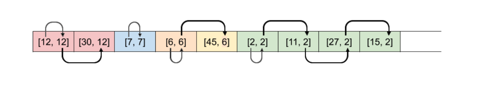
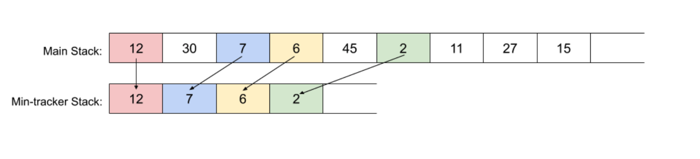
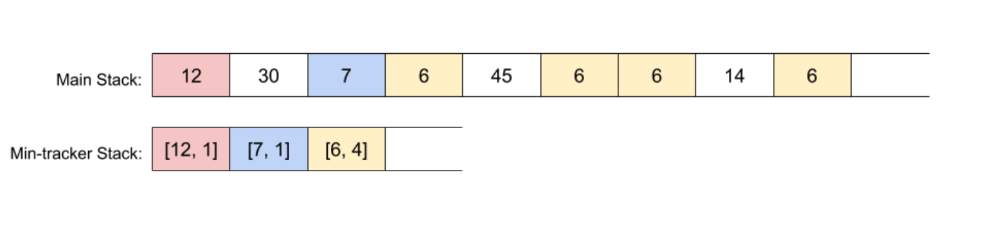

## 4.Stack

### 155. Min Stack

상당히 흥미로운 문제

stack의 특성과 min 값을 추적하는 방법에 대해서 잘 생각해봐야한다
불변성을 잘 생각해봐야한다
stack의 element가 들어오고 나가는 것은 항상 가장 마지막, 위 element에서만 발생하기 때문에
나머지 부분은 항상 불변이다

여기서는 아래 3가지 단계로 설명하고 있다.
중요한 것은 바로 밑의 값과만 비교해서 최소값이 갱신되었다면 뭔가 추적할 수 있는 메커니즘을 넣는 것이다

{width="800" height="400"}
{width="800" height="400"}
{width="800" height="400"}

