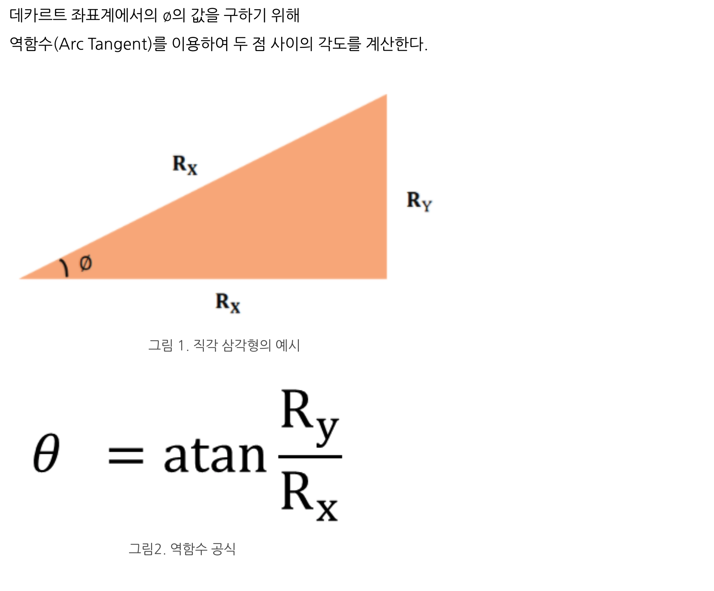

# Top Interview Questions > Easy

# Array

## 1_Two_Sum
첫번째로 주어진 int 형 배열 속에서 서로 다른 두 수를 더해 두번째로 주어진 수가 되는 쌍의 index를 반환한다.

x + y = z 라는 수식을 z - x = y 로 거꾸로 생각할 수 있어야 하는 문제.

y를 O(1)에 조회하기 위해서 hash map을 사용해야 한다. hash map을 사용하여 해결하는게 핵심

## 26_Remove_Duplicates_from_Sorted_Array
새로운 List를 생성하는게 아니라 받은 List를 그대로 변형시켜야 한다.

같은 숫자들이 연속될때는 del로 삭제해주고 포인터를 이동시키면 된다.

## 48_Rotate_Image

테트리스 모양을 뒤집듯이 2차원 배열을 대각선으로 자른 뒤 서로 대칭점에 있는 숫자들을 교환한 뒤 2차원 배열 자체를 reverse 해준다

## 122_Best_Time_to_Buy_and_Sell_Stock_II

가격이 오름차순으로 연속될 때는 무시하고 가격이 떨어지는 순간 이전 가격(가장 비싼 가격)에서 매도하고 지금 가격에서 매수하도록 한다

## 136_Single_Number

hash table을 쓰면 O(n) / O(n) 이 풀 수 있긴하다
수학적, 컴퓨터 공학적으로도 해결이 가능한데
2 * sum(set(nums)) - sum(nums)
혹은 XOR 연산을 통해서도 해결할 수 있다

## 189_Rotate_Array

배열을 k 만큼 우측으로 밀고, 배열 크기를 벗어나는 숫자들은 왼쪽에서 차오르도록 배열을 변형시키는 문제

k 자리를 기준으로, 전체 reverse -> k 우측, 좌측을 1번씩 더 reverse 하면 해결할 수 있다

## 217_Contains_Duplicate

set 으로 hash table 로 변형한 뒤 길이를 비교하면 쉽게 해결 가능

## 66_Plus_One

list를 string, int로 변환 한 뒤에 +1 해주고 다시 list로 변환해서 풀 수도 있을 것 같다

배열의 마지막부터 loop를 돌면서 9면 다음 아이템도 보고, 9가 아니라면 +1하고 끝.

0번째까지 갔는데 9라면 첫번째 아이템으로 1을 추가해줘야 한

## 283_Move_Zeroes

0의 개수를 세면서 del로 삭제한 뒤, 마지막에 0의 개수만큼 append해준다

## 36_Valid_Sudoku

가로, 세로, 구간별로 list를 잘 자를수 있느냐의 문제
lambda식을 사용하면 쉽게 자를 수 있다

## 350_Intersection_of_Two_Arrays_II

교집합을 찾는 문제이다
단순히 중복을 찾는 문제와 다른 점은 개수도 답에 영향을 미친다는 것
hash 테이블을 만들어서 해결하는 방법도 있고, 정렬된 상태에서 이진 탐색으로 조회할 수도 있다
이진 탐색이 best 인거 같음

# Strings

## 344_Reverse_String

x, y 위치의 문자열을 XOR 연산 3번을 반복하면 추가 메모리 공간없이 치환할 수 있다

## 7_Reverse_Integer

숫자 -> 문자 변환 후 reverse 하고 다시 숫자로 변환
reverse 할때는 s[::-1] 로 간단하게 할 수 있음
python 에서 interger.MAX_VALUE 확인은 x > (1 << 31) - 1 로 확인 가능

pop, push 하는 방식으로도 풀 수 있는데
pop y/10
push y * 10 + x

## 387_First_Unique_Character_in_a_String

hash 맵 만들어서 풀이 가능

## 242_Valid_Anagram

sort 하는 것으로 쉽게 풀이 가능

## 126_Valid_Palindrome

펠린드롬이란 앞 뒤로 읽어도 똑같은 문자열
정규표현식으로 문자 제거 후에 reverse 비교로 풀이
정규표현식은 \w \W 가 반대의 의미이고 \w에는 _ 문자가 포함된다는 것에 주의

## 8_String_to_Integer_(atoi)

알고리즘 문제라기 보다는 함수 하나를 작성하는 문제
python 코드 상에서 overflow에 대한 처리가 좀 까다로웠다

## 28_Implement_strStr()

쉽게 풀면 이중 for loop 로 풀 수 있고..
제대로 풀려면 KMP, rabin karp 알고리즘으로 풀어야 한다

## 38_Count_and_Say

이전 term을 발음을 통해 현재의 term을 만드는 방식이다
재귀로 풀거나, 미리 배열을 만들어두면 더 효율적으로 해결할 수 있다

## 14_Longest_Common_Prefix

LCP 문제인데, 푸는 방법이 굉장히 다양하다
LeetCode solution 에서 소개하는 방법은 수평 스캔, 수직 스캔, 분할정복, 이진탐색, 트라이
다양한 방법으로 코딩하는 방법을 알아두면 도움이 많이 될 것 같다

# LinkedList

## 237_Delete_Node_in_a_Linked_List

Node 객체 자체가 next 변수를 통해 서로 연결되어 있기에 리스트와 삭제 대상을 따로 받지 않아도 된다
LinkedList에서 특정 노드를 삭제하는 방법은 이전 연결을 next node로 연결해주면 된다

## 19_Remove_Nth_Node_From_End_of_List

이 문제는 조금 더 생각을 필요로 한다
next 밖에 없기 때문에 뒤에 n 번째에 있는 node를 삭제하기 위해서는 트릭이 필요하다
1개의 포인터만 사용한다고 보면 우선 전체를 순회해서 length를 계산한 뒤, length - n 위치의 node를 삭제하면 된다
이때 원소가 1개인 경우에 삭제하면 빈 linkedList가 되어야 하는데, 이러면 이전노드와 다음노드를 연결하는 방식으로 삭제할 수가 없기에 제일 앞쪽에 dummy node를 추가하는 방법을 사용할 수 있다
2개의 포인터를 사용한다면 서로 n 만큼 위치 차이를 둔 뒤, 앞서가는 포인터가 끝에 다다를때 뒤쪽 포인터를 삭제하면 된다

## Reverse_Linked_List

### 반복문
O(n), O(1) 풀이법

순서를 스위치해야되니깐, 임시변수를 하나 정도는 써야겠구나..하는 생각을 해야한다. 각 단계마다 이전 node 값으로 연결해줘야하니깐 prev 변수도 하나 필요하겠구나. 라고 생각이 들면 클리어

### 재귀
O(n), O(n) 풀이법
재귀방식이라 stack space가 추가로 필요하다

재귀방식의 핵심은 n1, n2 ... nk, nk+1, nk+2 ... nm 이라고 생각해봤을때 nk 에서 로직이 수행된다고 했을때 nk+1 부터 nm 까지는 이미 리버스되었다고 생각해야한다

nk+1 ~ nm 까지는 리버스되었다 + 탈출조건 + 리턴해야하는 최종 변수가 무엇인지를 잘 생각해보면 풀이할 수 있다

## Merge_Two_Sorted_Lists

기존 리스트에 채우거나, 새로운 리스트에 작은 것부터 채우는 방법으로 생각해볼 수 있다

다만 curr 포인터에 직접 대입하는 것은 start 부터 연결되는게 끊어지는 결과를 만드므로 curr.next 에 대입하는 방식으로 연결해야한다

## Palindrome_Linked_List

팰린드롬은 짝수, 홀수 길이 모두에서 가능하다

slow, fast 2개 포인터를 두고, fast 포인터만 2칸씩 이동시키면 fast 포인터가 마지막 노드에 도착할때 slow는 절반을 이동하게 된다

이때 slow 포인터부터 reverse 한 리스트와 head 부터를 비교해보면 팰린드롬인지를 확인할 수 있다

## Linked_List_Cycle

일단 사이클 탐지는 HashMap을 사용하면 가능하다. 공간복잡도 O(N)

공간복잡도 O(1)으로 풀려면 플로이드의 find cycle 알고리즘을 사용해야한다. 이거를 사용하면 사이클이 시작하는 지점도 찾을 수 있다.

링크드리스트 문제에서 핵심은 추가적인 포인터를 사용할 줄 알아야하고 (prev, curr), 두가지 포인터를 각각 다른 step으로 전진시키면서도 생각해봐야하고, reverse해서 비교하는 것도 생각해봐야한다.


## 424_Longest_Repeating_Character_Replacement

sliding window 문제인데, tail, head를 써야할 뿐만 아니라 tail ~ head 사이에 가장 많이 등장하는 알파벳의 개수도 저장해두어야 한다.
컨셉은 "전체 길이에서 가장 개수가 많은 알파벳의 개수만큼은 생각하지 않아도 된다. 그 만큼은 k 로 바꾸지 않아도 된다."

## 844_Backspace_String_Compare

stack_s == stack_k 처럼 리스트가 동일한 item을 가졌는지 비교하는 것 보다,
''.join(stack_s) == ''.join(stack_t) 처럼 string 형태로 만들어서 비교하는게 훨씬 빠르다.


# 알고리즘 지식

## 다양한 컨셉

* set 으로 중복을 제거하는게 유리한가?
* pointer 를 두개 두는게 유리한가?
	- head, tail ?
	- slow, fast ?
* 처리하지 않아도 되는 (min, maximum 조건) 조건에서는 바로 return 해버리는게 성능이 많이 도움이 된다.
* 뒤에서부터 처리 가능한가?

## 플로이드의 순환 탐색 알고리즘(Floyd's cycle detection algorithm)

* 142. Linked List Cycle II

fast와 slow 포인터가 점 p에서 만날 때 그들이 달린 길이는 'a+2b+c'와 'a+b'이고 fast가 2배 빠르게 이동하기 때문에 a+2b+c == 2(a+b)가 됩니다. 최종적으로 우리는 'a==c'를 얻을 수 있습니다.

## 트리 순회 방법(tree traversal)

* 98. Validate Binary Search Tree
	- Inorder 예시

Inorder, Preorder, Postorder
중위순회, 전위순회, 후위순회
왼쪽>루트>오른쪽 / 루트>왼쪽>오른쪽 / 왼쪽>오른쪽>루트

stack이나 recursive로 구현한다.
stack은 DFS

Levelorder traversal
root 부터 한 레벨씩 아래로 내려간다.
level order는 Queue로 구현한다.
queue는 BFS


## Anagram

sort 해보면 두 문장이 anagrame인지 알 수 있다. sort 하는데 O(nlogn)
각 알파벳의 출현빈도를 카운팅. O(n), O(256) or (1) 상수 공간복잡도
unique 문자로만 구성이 되어 있다면 set을 사용할 수 있다. 아니라면 hashmap 으로 카운팅
출현빈도 카운팅을 bitwise 하게 한다면 공간복잡도 O(1)


# Top Google Questions

## 146. LRU Cache
> https://leetcode.com/problems/lru-cache/solutions/244744/lru-cache/

기본적인 컨셉은 가장 최근에 접근한 데이터를 유지하기 위한 queue가 필요하고, 조회를 O(1)에 하기위한 map이 필요하다
문제는 조회, 삽입시 queue의 가장 앞으로 와야한다. 그리고 삽입시 capacity를 넘어가면 가장 뒤의 데이터를 삭제해야한다

이런 자료구조 설계를 할때, 시간복잡도와 공간복잡도를 만족시키는 것도 중요하지만..
구현관점에서는 자료구조에서 제공해줘야하는 메서드가 무엇일까? 를 생각해봐야한다

LRUCache에서는 init,get,put 메서드를 당연히 지원해줘야겠지만
여기서는 가장 나중에 접근된 데이터를 지우는 popitem, remove tail 같은 메서드가 필요하고,
한번 접근시 해당 아이템을 가장 최근 큐에 위치시키는 move to head, move to end 같은 메서드가 필요하다

* step1
	- Ordered dictionary
	- 딕셔러리인데, 순서를 유지하는 딕셔너리이다
	- 언어에서 지원해주는 자료구조가 아예 있다
		+ java: LinkedHashMap
		+ python: OrderedDictionary
			* move_to_end, popitem
* step2
	- Hashmap + DoubleLinkedList
	- Hashmap으로 접근시에도 가장 최근 queue(deque)로 가져와야한다
	- LRUCache에서는 head, tail 두 포인터를 유지해야한다

{width="1000" height="600"}


## 42. Trapping Rain Water
> https://leetcode.com/problems/trapping-rain-water/solutions/127551/trapping-rain-water/

히스토그램 문제와 굉장히 유사하다
히스토그램 문제는 사각형들의 이어진 넓이를 구하는것이였고, 이 문제는 사각형들의 높이가 이루는 어떠한 직사각형들의 넓이 합이다
(히스토그램 문제는 분할정복 or stack 풀이법이 있다)

stack 사용의 핵심은 stack에 index를 저장하는 것이다.
높이비교는 height[stack[0]] 이런식으로 비교한다


사이사이에 끼는 작은 사각형들은 그냥 무시하고, 전체 다각형의 넓이를 구한뒤, height sum을 빼주는 식으로 접근했다
stack을 이용해서 left -> right 한번 계산하고, 마지막으로 right -> left 한번 계산한다
> 근데 솔루션을 보면, 이방법은 stack 방법이 아니라 2 pointer (left, right) 방법에 더 가까운것 같다

> 중요한 컨셉은 특정 x 좌표에서의 물의 높이는 min(left part highest block, right part highest block) 가 된다는 것이다
* step1
	- brute force
		+ 특정 x 좌표에 차게될 물의 높이는 left part 에서 가장 높은 블럭과 right part 에서 가장 높은 블럭. 두 블럭 중 낮은 것의 높이만큼 물이 차게된다
		+ 이 점을 이용해서 특정 x 좌표에 차게될 물의 양을 하나씩 하나씩 계산한다 O(N)
		+ left part 에서 가장 높은 블럭과 right part 에서 가장 높은 블럭을 탐색하려면 O(N)번 탐색이 필요하다
		+ 따라서 총 O(N^2)
* step2
	- DP or prefix sum
		+ brute force 방식에서 left part, right part에서의 가장 높은 블럭을 찾는것을 미리 전처리해둔다
		+ left -> right 방향으로 탐색할때 max 블럭의 높이, right -> left 방향으로 탐색할때는 max 블럭의 높이. 2가지 배열을 전처리로 생성한다
		+ 이후 과정은 brute force와 동일
		+ O(N)
* step3
	- stack
		+ 지금 탐색 중인 블럭의 높이가 stack.top 보다 크다면 pop하면서 계산을 시작한다
		+ distance를 구하는 것은 쉽다
		+ height를 구할때는, 아래 부분까지 다 구하는게 아니라 윗부분만 구할 수 있다
			* `int bounded_height = min(height[current], height[st.top()]) - height[top];`
			* 지금 블럭의 높이 or 직전 stack에 있는 블럭 높이와 그 직전 블럭 높이의 차 중에서 최소값을 사용
* step4
	- 2 pointers
		+ 결국 가운데에 가장 높은 블럭이 오고, 가장자리쪽은 낮아지는, 삼각형의 형태를 띌수밖에 없다
		+ 따라서 left 에서 출발해서 높아지는 방향으로 넓이를 계산하는 것과 right 에서 출발해서 넓이를 계산하는 pointer를 둘 수 있다
		+ 탐색하면서 left max, right max 를 유지한다. 이것보다 낮은 것들은 넓이에 추가해주고, 아니면 left max, right max를 갱신해준다
		+ left part를 탐색할지, right part를 탐색할지는 height[left]와 height[right]의 크기로 결정한다
		+ height[left]가 height[right]보다 작다면 height[right]가 산의 꼭대기가 되기 때문에 left part를 계산하고, 아니면 right part를 계산한다


## 56. Merge Intervals

회의실배정 문제와 굉장히 유사하다

greedy하게 해결가능하고, start time 기준으로 정렬한뒤..경우를 생각해보면

a1        b1
   a2  b2


a1        b1
    a2      b2


a1        b1
               a2  b2

이런 세가지 경우를 생각해볼 수 있다
따라서 a2가 a1, b1 사이에 존재하면 overlap 되었다고 볼 수 있다

* step1
	- DFS + 컴포넌트 개수
		+ DFS 탐색을 위해서 그래프를 만들어야한다
		+ 각 노드마다 other 노드와의 edge를 만들기 위해서 O(N^2) 탐색이 필요하다
		+ 그래프가 만들어지면 DFS로 탐색하면서 컴포넌트의 개수를 세면된다
		+ 이때 '간선을 양쪽으로 연결' + 'visit 사용' 을 주의
* step2
	- greedy
	- start time 기준으로 정렬한뒤 for loop 돌면된다


## 253. Meeting Rooms II

회의실배정 심화 문제

이 문제는 무조건 모든 회의를 진행해야한다
'모든 회의를 진행해야한다'면 빨리 시작하는 것부터 진행하는게 좋다

빨리 시작하는것부터 회의실을 배정하는데, 회의실을 배정할때 가능한 가장 end time이 빠른 회의실에 배정해야한다
end time이 가장 빠른 회의실에서도 회의가 불가능할때 회의실을 추가한다
회의실은 동적으로 늘어난다

이러한 자료구조로 PQ를 사용할 수 있다


## 79. Word Search

자물쇠풀기 같은 백트래킹 문제
백트래킹에서는 visit 배열을 들어갈때 잠그고, 나올때 풀어야한다

이문제는 pruning을 어떻게도 할 수 있는가를 배울 수 있는 중요한 문제
가지치기를 score 기준으로만 생각했는데 아니다

* used set을 사용
	- 효과 X
	- used(x)(y)(word_index) 3차원 배열로도 대체 가능
	- 하지만 이 방법은 반례가 있다
	- visit 배열을 풀지 않으면, 다른 최적해가 방해를 받듯이, word_index 까지 같이 저장한다고 해도, 이미 최적해가 아닌 탐색이 해당 used 배열을 오염시켜버리면, 이후 최적해 탐색이 진입하지 못하는 경우가 생긴다
* is_find global 변수 사용
	- 효과 O
	- 경우의 수나 가장 긴 path를 찾는게 아니라서 무조건 답을 1개 찾아야한다
	- 따라서 답을 찾았으면 바로 탐색을 종료하면 된다
* 좌표 압축
	- 효과 X
	- 상하좌우에 일치하는 word가 있는지를 보는게 아니라 word 맵을 만들어서 다음 알파벳을 바로 찾아가도록 (이동 가능한지는 체크해야하지만) 하는 방법이다
	- 결과적으로는 더 느렸다.
	- 다시 생각해보면, 기존에는 상하좌우만 보면 되는데, 이 방법은 AAAAAAAAAAB 이런 보드가 있다고 하면, 오히려 4방향보다 더 많이 탐색해야 한다
* 애초에 답이 가능한지 불가능한지 판단
	- 효과 O
	- board판에는 word에 존재하는 모든 알파벳이 일단 존재해야한다
	- 존재하지 않는 경우 탐색을 진행할 필요가 없다
	- > 답이 존재하지 않으면 백트래킹에서 is_find global 변수를 둬도, 완전 탐색을 진행해버린다. 이 경우는 제거하는 것이 중요
	- board 판의 알파벳 개수와 word의 알파벳 개수를 카운팅하고 숫자가 부족한게 있으면 바로 False
* 탐색을 가능한 적게 진행한다
	- 효과 O
	- 진입점을 줄이는게 중요하다
	- word 시작 알파벳의 보드위의 개수보다 word 마지막 알파벳의 개수가 적다면, 마지막 알파벳부터 탐색하는게 유리하다

> 이 문제는 score를 답으로 내는 문제가 아니다. 따라서 가지치기를 score 기준으로 할 수 없다
애초에 답이 불가능한 경우를 제외하는 것이 최적이 아니라서 어차피 걸러진다고 생각할 수 있는데, 백트래킹에서는 이런 경우를 제거하는 것이 중요하다
또한 진입점을 줄이는 것도 매우 중요하다
3,4번을 적용했을때 8000ms -> 32ms

> 백트래킹에서는 worst를 제거하는 것이 중요!! 가지치기도 결국 worst를 제거하는 것이다


## 359. Logger Rate Limiter

같은 word는 10초내로 다시 출력할 수 없다

* step1
	- dequeue
		+ hash 풀이법밖에 안떠올랐는데 이런 밀어내는 문제는 queue로도 풀 수 있다
		+ 모든 메시지가 시간순으로 들어오기 때문에 10초가 지난 메시지들은 큐에서 제거하면된다
* step2
	- hash map, dictionary


## 210. Course Schedule II

의존성이 없는 노드만을 탐색할 수 있다
이때 의존성이란 in-degree가 없는 노드이다. 자기자신 쪽으로 edge가 없는

이 개념은 어느정도 떠올렸는데, 구현하는데 실패했다
꼭 탐색을 current에서 이어갈 필요가 없다

탐색시에 항상 in-degree가 없는 노드를 선정해서 탐색하고, in-degree를 업데이트한다
in-degree 업데이트시에 0이 되면 탐색 후보에 넣어준다

> DFS를 진행해도 항상 노드를 current가 아니라 in-degree가 없는 노드를 새로 선정한다. BFS로 해도되고


처음에는 DFS로 그래프 사이클을 찾고, 사이클이 없으면 BFS를 진행하는 식으로 했는데 current에서 항상 이어나가려고해서 반례를 커버할 수 없었다


## 295. Find Median from Data Stream

min heap, max heap 으로 해결 가능
근데 이 문제는 꽤 다양한 방법으로 해결이 가능한 것 같다

* sorting every find query
* insertion sort
	- add 할때 insertion sort
		+ logN
		+ 항상 정렬되어 있기 때문에 lower_bound(binary search)로 element가 들어갈 index를 서치
* two heap
* multiset and two pointers
* segment tree도 가능한듯?
	- range median query?

## 239. Sliding Window Maximum

문제를 보자마자 segement tree가 떠올랐다
세그먼트트리로 max query를 N번 수행하면, NlogN 해결 가능

솔루션을 보니 deque, DP로도 해결이 가능하다. O(N)

> max값을 유지하는 slideing window 테크닉은 알아두면 좋을것 같다

* step1
	- segment tree
* step2
	- DP
* step3
	- deque
		+ window deque를 유지한다 (element index)
		+ element를 추가할때 해당 element 보다 작은 값은 window에서 제거한다
			* 왜냐면
			* 방금 들어온 element는 window에서 가장 오래 살아남는다
			* 그래서 지금 들어온 element 보다 작은 것들은 절대로 largest element가 될 수 없다
			* 이렇게하면 지금 들어온 element 보다 큰 값들만 window의 앞쪽에 남는다
			* 즉, window의 가장 앞에 가장 큰 element의 index가 남는다
		+ 가장 큰 element의 index가 window를 벗어났다면 제거한다
		+ 그리고 남은 window의 가장 앞이 현재 window에서 가장 큰 값이다


## 334. Increasing Triplet Subsequence

LIS 문제를 까먹고있어서 좀 해멨지만...
최장증가수열 LIS 문제
여기서는 LIS의 길이가 3을 넘는지 안넘는지만 판단하는 문제다

LIS는 DP + lower bound로 해결이 가능하다
> 이때 lower bound는 내가 알고있는 일반적인 binary search 구문과 다르니 유의

근데 LIS까지 할 필요는 없고, 3개가 되는지만 보면 되어서...
two pointer와 유사하게 해결 가능하다

first(max), second(max) 를 유지하면서
현재 값이 first 보다 작으면 first를 업데이트한다
그게 아니라 second 보다 작으면 second를 업데이트한다
그것도 아니면 답이 된다.

왜냐하면 first 보다 큰 값은 second가 된다
first는 계속해서 작아진다
second도 first와 second 사이에서 계속 작아진다
현재 값이 first, second 보다 더 크다면 그 이전에 3개까지는 LIS가 된다는 뜻이다


## 394. Decode String

stack, recursive 문제이다

괄호가 중첩될 수 있기 때문에 decode한 문자열을 다시 stack에 넣어야한다
만약에 방금 decode한 문자열이 또 다른 괄호 안에 존재하는 거라면, 지금 decode한 문자열이 향후에 여러번 반복되기 때문이다
다음번 닫는 괄호에서 k번만큼 반복에 포함되도록 stack에 다시 넣어야 한다

시간복잡도 계산이 좀 어렵다
stack에 다시 넣는 부분이 있어서...이게 얼만큼 반복될지를 알아야하는데,
괄호안에 중첩된 횟수만큼 stack에 다시 들어간다
그리고 그리고 그게 max k 만큼 반복된다

따라서 (k ^ nested 괄호횟수) * (괄호 string 길이 중 최장) 만큼 stack이 커질 수 있다


* step1
	- stack
* step2
	- recursive
		+ > https://leetcode.com/problems/decode-string/solution/
		+ recursive 혹은 stack 2개로 해결한다면 다시 stack에 넣는 부분이 없어서 좀 더 빠르다
		+ recursive는 뭔가 예외처리해야할게 좀 많다...solution 참고


## 1293. Shortest Path in a Grid with Obstacles Elimination

벽돌부시기 BFS 문제이다

* step1
	- 3차원 visit
* step2
	- a star
	- a star 알고리즘으로 해결이 가능하다고 한다. 기회가 된다면 구현을 봐보면 좋을 것 같다
	- > https://leetcode.com/problems/shortest-path-in-a-grid-with-obstacles-elimination/solution/
	- heuristic, priority queue, manhatan distance
	- 상한은 BFS 방식보다 높지만, 일반적으로 BFS보다 빠르다고 한다 


## 729. My Calendar I

event가 들어올때마다 모든 event와 start, end를 비교하면 N^2
> 처음에는 segment tree로 해결하려 했는데....segement tree로 하면 업데이트마다 N logN

(start, end). 2개의 값이 있지만 binary search로 원하는 값을 logN에 찾는 문제라고 한다

각 언어별로 binary search가 어떻게 지원되는지 알고있으면 좋다

* C++
	- map
		+ lower_bound, upper_bound
* Java
	- TreeMap (레드블랙트리)
		+ ceilingKey, floorKey
* Python
	- SortedList, bisect
		+ bisect_left, bisect_right

포인트는 이미 calendar에 들어있는 event들은 유효한 것들이고, 정렬되어있다
이상태에서 start 기준으로 우선 보는 것이다. 이전에 들어온 event들 중에서 start가 가장 비슷한 것을 찾는다
큰 start ? 작은 start ? 무엇을 찾아야할까

어쨋든 하나를 찾아서 양쪽을 비교해야한다

> start = key
  end = value
로 이전 element와 이후 element 사이에 start, end가 들어갈 수 있는지를 확인한다

element를 정렬된 상태로 유지하고 싶을때는 Python SortedList를 사용하자


## 528. Random Pick with Weight

샘플링 문제
단순하게 생각하면 weight 만큼 element를 더 채우고, 그 전체 배열에서 랜덤으로 element를 선정하면 된다
하지만 그 전체 배열을 다 유지하는 것은 낭비다

압축이 필요하다
weight 만큼 element를 채워보면, 일정 구간 사이의 element가 pick 될 경우 모두 그 index가 정답임을 알 수 있다
전체 index는 몇개일까? 모든 weight의 합이다
그럼 index를 랜덤으로 뽑았을때, 그 index가 arr[i-1] ~ arr[i] 사이에 존재하다면 i번째 element를 랜덤으로 뽑았다는 말이다

end index 만을 보관하는 배열로 압축하자
이때 end index를 binary search로 검색할 수 있다


## 1136. Parallel Courses

indegree가 0인것 부터 지우는 문제

기본적으로 이런 문제는 BFS + indegree 보관 map 으로 해결이 가능하다

여기 솔루션에서는 DFS + DP 방법도 제시한다
아이디어는 cycle이 없는 그래프에서 Longest Path를 찾으면, 그게 step의 수가 된다는 것이다

cycle 판단은 visit, finish로 가능
트리가 아닌, 방향 그래프에서 longest path는

`dp[node] = max(dp[node], 1 + max(dp[child1], dp[child2], dp[child3]..))`
로 찾을 수 있다
이때 모든 노드에서 출발해봐야하고, 각 노드에서 자신의 edge를 따라서 DFS해봐야한다
각 탐색에서 모든 edge에 대해 DP를 계산해봐야한다

최종적으로 DP배열 중에서 가장 큰 값이 답


## 2421. Number of Good Paths

start, end 모두 동일한 숫자
경로에 있는 숫자들은 모두 start, end 보다 작거나 같은 숫자

모든 node(i)에서 출발하여 탐색해본다
N^2


트리에서 어떠한 경로는 유일하다
자기보다 큰 수를 만난다면 탐색을 종료해도된다

어떠한 노드에 도착했을때, 해당 노드의 value가 나보다 작거나 같다면...해당 노드의 good path 중 일부가 지금 노드도 가능하다

생각을 조금만 바꿔서...value가 1인 노드들은 good path가 어떨까? 경로에 있는 숫자들은 1로만 이뤄져야한다
value가 2라면? good path는 1 or 2 로만 이뤄진다.

따라서 value가 작은것부터 good path를 만들고...value가 같은 것들끼리 이미 만들어진 good path를 이용할 수 있는지를 봐야한다


UnionFind를 사용


같은 value에 대해서 여러가지 Group이 생길텐데, 한 Group 내에 동일한 value가 예를들어 N개 라고 하면,
만들수 있는 good path는 1 + 2 + 3 이 된다 (single node를 포함하여)
등차수열의 합이 되기 때문에 N * (N+1) / 2 로 good path의 개수를 구할 수 있다

이걸 모든 value에 대해서, 모든 Group에 대해서 구해서 더해주면 된다


> 이 문제를 binary search로 푼다고? 에 이은...
> 이 문제를 union find로 푼다고? ...
> hash, binary search, union find 자료구조는 정말 많은 문제에 적재적소에 쓰이는 것 같다. 항상 생각하자

> union find는 그냥 사용하려고하면 느낌이 잘 안온다.
> union 하는 순서를 조정하면...어떠한 그룹이 어떠한 그룹을 특정 순서로 포함해나가는게 가능하다면?? union find를 고려해보자


## 1048. Longest String Chain

코드시그널 문제랑 바로 위 문제를 풀면서..뭔가 value를 map의 키로 한다던가, length를 map의 키로 한다던가 해서 한단계씩 나가는 것에 대해서 좀 익숙해진 것 간다.

이 문제도 이해해보면, 이전 element와 길이가 딱 1 차이나는 것들이다
따라서 length 별로 집합을 만들고, 다음 length와 predecessor 관계가 맞는지 확인 후 edge를 연결한다
그 다음 DFS를 통해 가장 긴 길이를 구하면 답이 된다

근데 이런 전처리 과정이 없어도..그냥 전부 map에 넣어두고 char를 하나씩 뺀 String을 다음 DFS에 넘기는 방식으로도 가능하다
어차피 sub string이 존재하지 않으면 DFS 탐색이 더 이뤄지지 않는다
(top-down DP, bottom-up DP)


## 4. Median of Two Sorted Arrays

Median의 정의.
Array의 중간에 위치한 element
만약 짝수라면, (a[i] + a[i-1])/2 의 값

정답의 컨셉은 두개의 array를 합쳤을때, 중간에 위치하는 element를 찾는 것이다. 어떻게?
각각의 array에서 얼마만큼의 left part를 떼어와야 전체 left part를 구성할 수 있는지를 찾는 것이다

두 array에서 각각 binary search를 하는 것은 너무 어렵다
smaller array를 기준으로, 현재 범위를 줄여야하는지, 늘려야하는지를 bigger array에서 확인하는 것이다

```python
        left, right = 0, len(nums1)-1
        while True:
            mid1 = (left + right) // 2
            mid2 = half - (mid1+1) - 1

            Aleft = nums1[mid1] if mid1 >= 0 else -sys.maxsize
            Aright = nums1[mid1+1] if mid1+1 < len(nums1) else sys.maxsize
            Bleft = nums2[mid2] if mid2 >= 0 else -sys.maxsize
            Bright = nums2[mid2+1] if mid2+1 < len(nums2) else sys.maxsize


            if Aleft <= Bright and Bleft <= Aright:
                if total % 2 == 0:
                    return (max(Aleft, Bleft) + min(Aright, Bright)) / 2
                else:
                    return min(Aright, Bright)
```

index range를 벗어날 수 있기 때문에, padding을 해줘야하는데 진짜 padding 처리를 하는게 아니라 벗어나면 INF, -INF 값으로 할당한다


## 2034. Stock Price Fluctuation

segment tree가 떠올랐지만..
이문제는 PQ문제이다


PQ 문제라고 생각을 해보면, min heap, max heap을 유지하고 값 업데이트에 hash를 써야한다는게 떠오른다
min, max 출력시 가장 앞의 데이터가 hash 값과 다르다면 업데이트가 발생했다는 뜻이므로 버린다


PQ 문제는 어떻게 보면 다시 frequency 빈도수를 저장한 map으로도 해결할 수 있다 (SortedMap)
빈도수가 0이 되면 element를 삭제해준다.

SortedMap을 사용하여 가장 작은 key, 가장 큰 key에 바로 접근한다


## 818. Race Car

완전탐색 문제로 해결하려고 했지만 TLE

여러가지 방법이 가능하지만..greedy + BFS 방식으로 해결 가능하다

일단 목적지가 정해져있기 때문에 굳이 돌아서 갈 필요가 없다
target보다 멀어지는 방향으로는 탐색하지 않는다

따라서 target을 지나쳤을때는 반드시 reverse
speed가 음수인데 target에 아직 도착안했으면 reverse
하면서 탐색하면된다

pq를 사용해도 되는데 그냥 deque를 써도 해결가능하다


DP 솔루션은 상당히 어려워 보인다..


## 1610. Maximum Number of Visible Points

기하 + sliding window

visible 영역이 있고, 그 안에 최대로 점을 담을 수 있는 개수를 구하는 문제이다

x,y 좌표의 점을 각도로 변환하고 sort하면 sliding sindow로 풀 수 있다

다만...
* x,y 좌표를 각도로 변환해야한다
* 첫번째점에서 마지막점까지 for-loop를 돌면, 마지막점 <-> 첫번째점 사이의 각도는 탐색하지 못하는 문제를 해결해야한다


우선 두 점 사이의 각도는 어떻게 구할 수 있을까?

{width="800" height="500"}
{width="800" height="500"}

1 radian = 57.2958 degree
호의 길이가 반지름과 같게 되는 만큼의 각을 1 라디안(radian)이라고 정의


```python
            radian = atan2(y2-y1, x2-x1)
            degree = (radian * 180) / math.pi
            if degree < 0:
                degree += 360
```

여기서는 각도가 음수가 나오면 계산이 복잡해져서 360도 기준으로 각도가 형성되게 조정한다


마지막 edge case는 어떻게 처리할까?

가장 쉬운 방법은 1번더 for-loop를 도는것이다.
근데 2번째 iteration에서는 마지막 점의 각도는 큰데, 다시 첫번째 각도를 바라보면 각도 차이가 크다.

데카르트 좌표계에 갇혀서 생각하지말고, 좌표를 쭈욱 펼친다고 생각해보자
어차피 각도는 360도를 더해도 동일한 각도이지만, 각의 가까움은 좁혀질 수 있다

2번째 iteration에서는 +360 더한 각도와 각의 차이를 비교해주자


또한 동일한 좌표의 두 점은 각도를 계산할 수 없으니 반드시 answer에 포함되도록 예외처리가 필요하다


## 2416. Sum of Prefix Scores of Strings

전형적인 trie문제

trie 자료구조를 처음 구현해보는 것 같은데...
어렵지 않다!!

일단 기본적으로 아래와 같이 배열로 만들 수 있다

```python
class Trie:
    def __init__(self):
        self.children = [None for _ in range(ord('z') - ord('a') + 1)]
        self.visit = 0
```

dictionary로 만들면 훨씬 효율적으로 가능하다
아스키코드를 숫자로 변환하지 않아도 되고, 공간도 효율적

```python
class Trie:
    def __init__(self):
        self.storage = {}
        self.visit = 0
```


## 715. Range Module

다시 인터벌 문제다
이런 인터벌 문제는 segment tree로 풀려고 하지말고 OrderedMap, SortedList, Binary Search 로 해결해야한다

인터벌을 merge하거나 split하거나 query를 수행해야한다

인터벌 문제는 해결하는데 테크닉이 상당히 중요한 것 같아서 코드를 첨부한다
쿼리 자체가 N = 10^4 이다.
따라서 매번 쿼리마다 쿼리를 다시 쌓아도된다

매번 쿼리를 쌓을때 merge 해야하면 merge를 하고, 범위가 겹치지 않으면 그냥 append한다

split 할때는 조건을 명확히 해야하는데..
이럴때는 완전히 포함되는 경우 (remove range에 완전히 포함되어서 다시 쌓지 않아도 되는 case)
완전히 포함되지 않는 경우
를 먼저 처리하는게 좋다

이 이외의 경우는 무조건 겹치는 경우라서 경계선 처리를 해주면 된다
* remove range와 오른쪽 부분이 겹치는 case
* remove range와 왼쪽 부분이 겹치는 case
* remove range가 더 작아서 두개로 쪼개지는 case


```python
import bisect


class RangeModule:

    def __init__(self):
        self.intervals = []

    def addRange(self, left: int, right: int) -> None:
        bisect.insort(self.intervals, [left, right])

        res = [self.intervals[0]]
        for i in range(len(self.intervals)):
            interval = self.intervals[i]

            if res[-1][1] >= interval[0]:
                res[-1][1] = max(res[-1][1], interval[1])
            else:
                res.append(interval)
        self.intervals = res

    def queryRange(self, left: int, right: int) -> bool:
        i = bisect.bisect(self.intervals, [left, int(1e9)])

        if not self.intervals or i == 0:
            return False
        return right <= self.intervals[i-1][1]

    def removeRange(self, left: int, right: int) -> None:
        res = []

        for interval in self.intervals:
            if left <= interval[0] and interval[1] <= right:
                continue
            elif interval[1] <= left or right <= interval[0]:
                res.append(interval)
            elif interval[1] < right:
                res.append([interval[0], left])
            elif left < interval[0]:
                res.append([right, interval[1]])
            else:
                res.append([interval[0], left])
                res.append([right, interval[1]])
        self.intervals = res
```


위 솔루션은 매쿼리마다 O(N)이다
아래 쿼리도 slice 때문에 O(N)이긴 한데, 구현자체가 좀 더 빠르다

```python
import bisect

class RangeModule:

    def __init__(self):
        self.ranges = []

    # []

    def addRange(self, left: int, right: int) -> None:
        
        leftInsert = bisect.bisect_left(self.ranges, left)
        rightInsert = bisect.bisect_right(self.ranges, right)

        subsection = []
        
        if leftInsert % 2 == 0:
            subsection.append(left)

        if rightInsert % 2 == 0:
            subsection.append(right)

        self.ranges[leftInsert : rightInsert] = subsection

    def queryRange(self, left: int, right: int) -> bool:

        start = bisect.bisect_right(self.ranges, left)
        end = bisect.bisect_left(self.ranges, right)

        return start == end and start % 2 == 1


    def removeRange(self, left: int, right: int) -> None:

        start = bisect.bisect_left(self.ranges, left)
        end = bisect.bisect_right(self.ranges, right)

        subsection = []
        
        if start % 2 != 0:
            subsection.append(left)

        if end % 2 != 0:
            subsection.append(right)

        self.ranges[start : end] = subsection
```


## 1105. Filling Bookcase Shelves

DP!
솔루션 보지 않고 2차원 DP로 해결했다. 뿌듯...

DP(index)(level)
첫번째것은 무조건 쌓고,
두번째것부터는 현재 level에 쌓을지, 다음 level을 새로 시작할지 선택한다
(사실은 다음 level을 새로 쌓는다는거 자체가, 그 전까지는 현재 level에 쌓는다는 뜻이된다)


근데 솔루션을 보니 level 이란게 사실 필요가 없다

DP[i] = i+1부터 다음 level에 쌓았을때 최소 height. (현재층의 height + 다음층부터의 최소 height)


## 2101. Detonate the Maximum Bombs

폭탄을 터뜨리면 연쇄적으로 범위에 있는 폭탄들이 터진다.

범위에 있는 폭탄들을 graph로 만들어서 가장 깊게 탐색할 수 있는 node 수가 정답이 된다

그림에 낚여서 두 원의 위치관계를 연쇄폭발이 가능한 조건이라고 생각했다.
다시 생각해보면 반지름이 작은 폭탄을 먼저 터뜨리면 반지름이 크지만 멀리있는 폭탄을 터뜨릴 수 없다.
따라서 항상 bidirected가 아니다

원과 점의 위치 관계를 파악해야한다
원과 점의 직선 거리가 반지름보다 작거나 같으면 포함관계다

* miss 포인트
	- 두 원이 항상 양방향이 아니다. 원과 점의 관계로 생각해야한다
	- 위의 이유로 모든 점에서 한번씩 DFS를 해봐야 최적해를 얻을 수 있다


* 두 원의 위치 관계
```python
                # 두 원의 거리
                distance = math.sqrt((x1-x2)**2 + (y1-y2)**2)

                if distance == 0 and r1 == r2:
                    # 두 원이 동심원
                    edges[i].append(j)
                    edges[j].append(i)
                elif r1 + r2 == distance:
                    # 두 원이 외접
                    continue
                elif abs(r1-r2) == distance:
                    # 두 원이 내접
                    edges[i].append(j)
                    edges[j].append(i)
                elif abs(r1-r2) < distance < r1+r2:
                    # 두 원이 서로 다른 두 점에서 만남
                    edges[i].append(j)
                    edges[j].append(i)
```

* 힌 원과 한 점의 위치 관계
```python
                # 두 원의 관계로 생각하지 말고..한 점이 원 내부에 존재하는지를 확인하자. 이게 더 간단하다
                if i == j: continue
                distance = math.sqrt((x1-x2)**2 + (y1-y2)**2)
                if distance <= r1:
                    edges[i].append(j)
```

{width="700" height="500"}
{width="700" height="800"}


## 2096. Step-By-Step Directions From a Binary Tree Node to Another

LCA를 구한뒤
start -> LCA, LCA -> destination을 구하는 것이 가장 최단 경로이다

start -> LCA로 가는 것을 구할 수는 없으니
LCA -> start, LCA -> destination을 구해서 LCA -> start의 경로는 모두 'U'로 만들어주면 된다


depth 구하기 -> 찾으려는 두 노드의 depth를 맞춰준다 -> 한칸씩 올라가면서 두 노드가 같아지는 지점이 LCA이다


```python
class TreeNode:
    def __init__(self, val=0, left=None, right=None):
        self.val = val
        self.left = left
        self.right = right


depth = defaultdict(int)
parent = {}
hash = {}
LCA = None


def levelOrder(root: TreeNode, level):
    global depth, parent, hash
    if root is None:
        return

    depth[root.val] = level
    hash[root.val] = root

    if root.left is not None:
        parent[root.left.val] = root.val
        levelOrder(root.left, level + 1)

    if root.right is not None:
        parent[root.right.val] = root.val
        levelOrder(root.right, level + 1)


def searchLCA(startValue: int, destValue: int):
    global LCA, depth, parent, hash

    node1Value = startValue
    node2Value = destValue

    while depth[node1Value] != depth[node2Value]:
        if depth[node1Value] > depth[node2Value]:
            node1Value = parent[node1Value]
        else:
            node2Value = parent[node2Value]

    while hash[node1Value] != hash[node2Value]:
        node1Value = parent[node1Value]
        node2Value = parent[node2Value]

    LCA = hash[node1Value]
```


