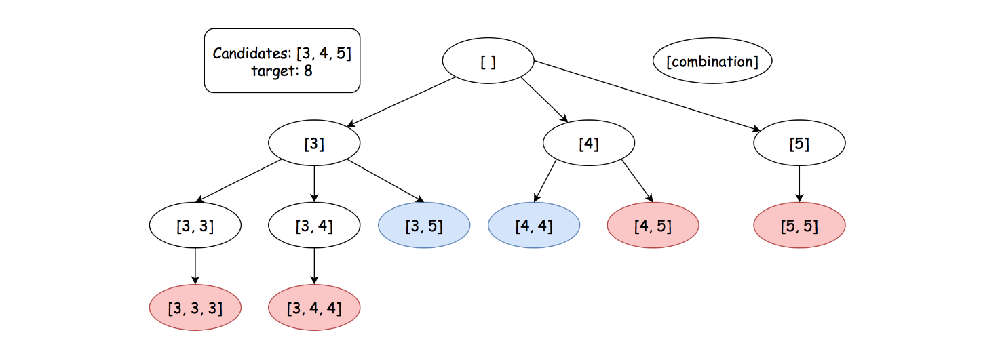

# tag-Google

## 2. Add Two Numbers

더할때마다 carry가 발생하면 다음번 계산에 더해준다.
reverse 연결해주기 위해서 prev 노드를 가지고 있는다

출력시에는 startNode.next (dummyNode.next)

## 419. Battleships in a Board

배틀쉽은 가로모양이거나 세로모양이다.
또한 인접하지 않는다.

2d array에서 색깔 칠하기 문제이다.

근데 advance 조건으로 1번만 for-loop를 돌아서, extra 메모리없이 해결할 수 있느냐..

색깔 칠하기 문제에서 영역이 가로모양이거나, 세로모양일때만 가능한 조건인것 같다.
top-left 귀퉁이를 만나면 무조건 +1 해준다.
top-left 귀퉁이라는 것은 위와 왼쪽이 '.'이어야 한다.
이렇게 세어주면 BFS를 할 필요가 없다.

## 39. Combination Sum

백트래킹 문제인데..
그래프 문제에서 시간복잡도 계산이 어렵다

쉽게 생각하면 노드가 몇개나 생기는지, root에서 가지가 몇개씩 생기는지를 생각해보자

{width="600" height="300"}

N ^ (T/M+1)

## 1268. Search Suggestions System

trie 방법이 떠올랐지만...제한조건이 약해서 그냥 backtracking으로 해결했다

trie 구현을 한다고 하면..마지막에 정답을 찾았을때 정답을 어떻게 추가할건지가 애매했다
3개만 뽑는 것도 그렇고..

lexicographically + unique word -> trie 를 떠올리는게 힌트다

근데 trie build가 오래 걸리기 때문에...빠른 답은 아닌 것 같다. 완전탐색보다 느렸다

sort 해놓고 backtracking 한다?? 이건 binary search 잖아!

## 238. Product of Array Except Self

나누기를 사용하지 않고 자기 자신을 제외한 나머지들의 곱을 계산한다

나누기를 사용할 수 있었다면 어떻게 했을까?
전체 product를 구하고, 하나하나 나눠서 제외시키면서 하지 않았을까 (근데 여긴 0도 있긴하다. 0은 전처리로 케이스 out 시켜버린다고 해도..)

나누기를 사용할 수 없으면 더하기 빼기로 해야할까?

prefix_sum을 사용할 수는 없을까

left, right prefix_sum을 각각 유지한다면, 왼쪽 오른쪽의 곱으로 현재 element를 계산할 수 있다

근데 공간복잡도 O(1)은??
left, right를 쓰지 말란 것인데.....좀 햇갈렸던게, 정답으로 제출하는 list는 공간복잡도에 포함이 안된다는 말이다. 이게 힌트인데

정답으로 제출하는 list에 바로 계산을 해라.라는 뜻이다
left prefix_products를 구하고, 거기서 오른쪽에서부터 right_product 변수 하나로 계산하면서 반영해주면된다

