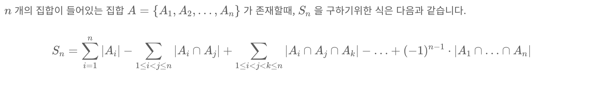
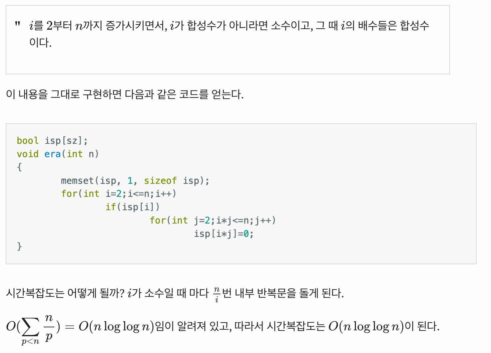
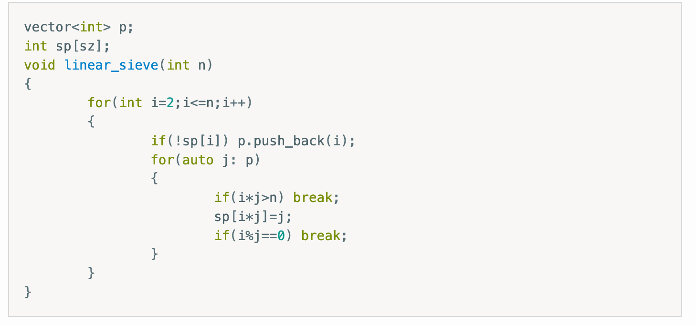
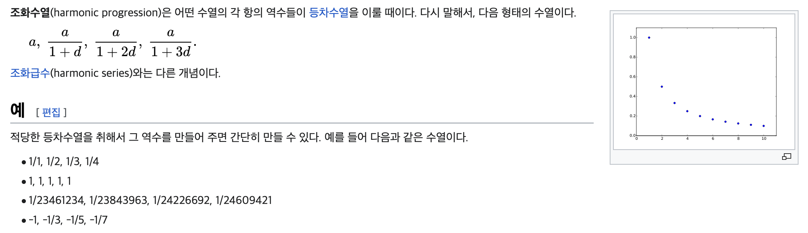
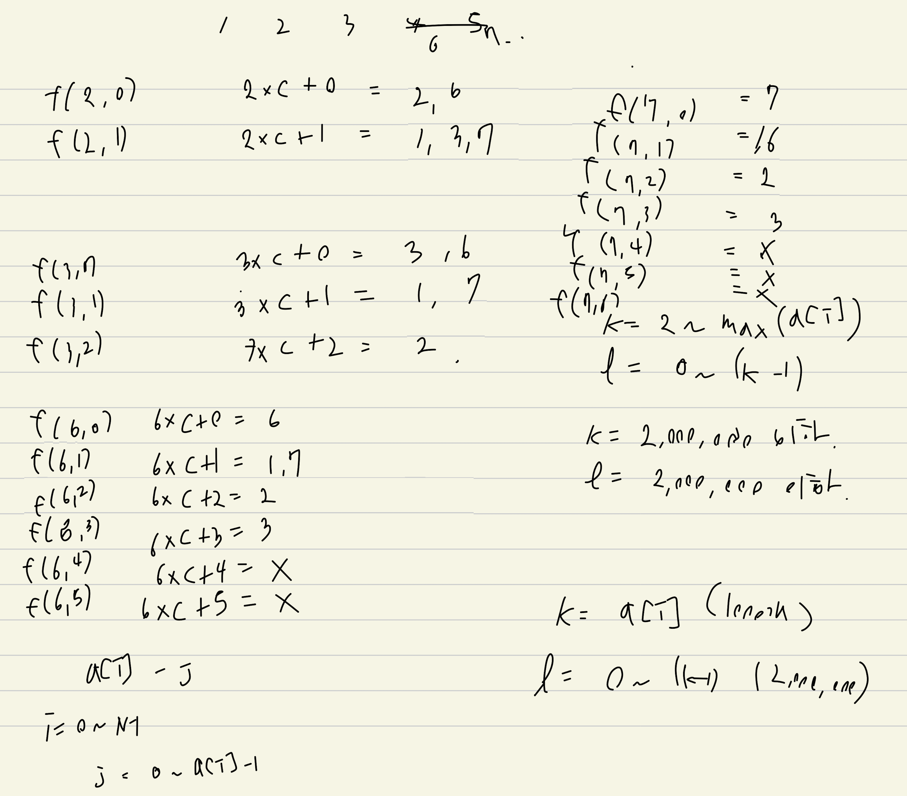

# day01. 기본기 잡기
> https://www.acmicpc.net/workbook/view/6593

> sqrt(N)까지로 범위를 축소하는 트릭

> 주된 아이디어는 약수를 세는 것 보다 배수를 세는 게 쉽다는 것 이다.
n의 약수들을 아는 것은 n을 소인수분해하는 과정이 필요하지만, d의 배수는 자명하게 d, 2d, 3d, … 임을 알기 때문이다.

> https://oeis.org/A006880
10^6 이하의 소수개의 개수 78498. 약 8만개
10^9 이하의 소수의 개수 50847534. 약 5000만개

> 10억까지의 수들은 소인수의 개수 자체가 아무리 많아도 9개이다

* 소수판별
	- 2 ~ sqrt(N) 이하의 모든 자연수에 대해서 나누어떨어지지 않는지를 판별
* 약수 세기/찾기
	- sqrt(N) 이하의 모든 자연수에 대해서만 찾으면 됨
	- a가 n의 약수면 n/a 역시 n의 약수이다. 하나는 sqrt(n) 이하이고, 다른 하나는 이상이다
* 소인수분해
	- 2 ~ sqrt(N) 이하의 모든 자연수에 대해서 나누어떨어지는지를 판별
* 에라토스테네스의 체
	- 2~n 이하의 자연수에 대해서 '그 자연수가 갖는 가장 작은 소인수'를 계산하는 방법 (spf. smallest prime factor)
	- 2~n 이하의 자연수에 대해서 '그 자연수가 갖는 서로 다른 소인수의 개수'를 계산하는 방법
	- 오일러 파이 함수
	- 전처리로 약수의 개수, 약수의 배수, 약수의 합 계산
* 오일러의 체
	- 소인수분해를 빠르게 하려면, linear sieve + spf
* 조화수열의 성질 (harmonic lemma)
* 서로소
	- 구간내의 서로소 개수 구하기

* 10억 이하 숫자의 소인수분해
	- 10억까지 모든 소수를 구할 필요는 없다.
	- 가장큰 소인수는 알 수 없지만, 두번째 큰 소인수가 sqrt(N) 보다 작다는 것은 자명하다
	- sqrt(N)까지의 소수만 구해두고, 소인수분해를 한 뒤, 그래도 소인수분해되지 않고 남은 수가 있다면 그 수를 가장 큰 소인수로 취급할 수 있다
* 모듈로 연산 횟수를 줄이는 법
	- MOD를 더하고 빼는 것으로 대체하자

* 포함배제의 원리
	- 기본적으로 1 ~ 2^n 까지의 index i가 있고...
	- 내부적으로 i & (1<<j) 가 일치하면 해당 값을 담는. 로직으로 구성된다
	- 그리고 교집합이 생기기 때문에 홀수개를 선택했다면 더하고, 짝수개를 선택했다면 빼고를 반복해야 한다

{width="800" height="100"}

* 전체 number에 대해서 for-loop 순회하는게 아니라 소수로 한정해서 탐색
	- '나머지가 같은 숫자들끼리 빈도수를 계산하여 가장 빈도가 높은 경우를 답으로 선택하는 것'같은 문제

## Linear Sieve

Linear sieve는 에라토스테네스의 체를 개선하여 N 이하의 소수를 O(N)만에 찾고
N 이하 자연수의 소인수 분해를 O(logN)에 할 수 있게 만들어 준다.

소수의 여부 대신 해당 수의 최소 소인수(Smallest Prime Factor. 이하 spf)를 나타내는 체(배열)를 둔다.

> https://ahgus89.github.io/algorithm/Linear-sieve/

우선 에라토스테네스의 체를 살펴보자. i가 소수일때마다 n/i번 반복문을 추가로 돈다.
nloglogn

{width="800" height="500"}

왜 시간복잡도가 O(N)이 아닐까?
일부 합성수들은 여러번 합성수로 판별이 된다

1번째 for-loop는 어떠한 숫자(소수 or 합성수)가 합성수로 체크가 되었는지를 본다
합성수가 아니라면 소수라고 판별하고, 그 소수의 배수들을 합성수로 판별한다

관점을 바꾸어...소수는 작은 것부터 판별이 되게 된다 (지금까지 구한 소수는 정렬되어있다)
어떠한 숫자에 지금까지 구한 소수들을 곱한다

어떠한 숫자 i, 지금까지 구한 소수들 p[j] 라고 한다면...
i * p[j] 는 합성수이다
이때 i % p[j] == 0 (i가 p[j]의 배수)이면 그 이상 큰 수에 대해서는 합성수 체크를 해주지 않아도 된다

{width="800" height="300"}

왜냐하면... 1000이란 숫자가 있다고 하자
소수는 2,3,5,7,11 .... 이렇게 있을거다

1000 * 2 = 2000
spf(2000) = 2
근데 1000은 2라는 소수의 배수다.
따라서 5도 1000의 소인수가 될 수 있지만, 최소소인수는 아니다.
따라서 탐색을 종료해도 된다

## 16563번: 어려운 소인수분해

보통 소수 구할때 라이 대회알고리즘에서는 백만정도까지 소수를 미리 구했던것 같은데
이 문제에서는 구해야하는 소수 범위가 5백만이고, 소인수분해까지 해야한다

이때는 오일러의 체를 사용해야한다

## 17425번: 약수의 합

약수를 구한다...그러러면 소인수분해를 해야한다...그러러면 소수를 구해야한다...

시간복잡도가 답이 없어진다

에라토스테네스의 체 방식을 응용해보자
모든 합성수에 대해서 그들이 가지는 소수를 1번씩 거쳐가게된다

따라서 범위 안의 모든 number에 대해서 그들을 거치는 소수를 + 해주면, 최종적으로 그 소수 or 합성수가 가지는, 약수들의 합이 더해진다

> 주된 아이디어는 약수를 세는 것 보다 배수를 세는 게 쉽다는 것 이다.
n의 약수들을 아는 것은 n을 소인수분해하는 과정이 필요하지만, d의 배수는 자명하게 d, 2d, 3d, … 임을 알기 때문이다.

## 158897번: 잘못 구현한 에라토스테네스의 체

이 문제는 에라토스테네스의 체와는 관련이 없고, 조화수열 문제이다.
조화..뭐요?

조화수열이란 n / (n/i) 의 형태를 띄는 수열이다
> 조화수열(harmonic progression)은 어떤 수열의 각 항의 역수들이 등차수열을 이룰 때이다.

{width="800" height="250"}

input을 몇개적어보면..

n=12
i=1 -> 1,2,3,4,5,6,7,8,9,10,11,12 	(12개)
i=2 -> 1,3,5,7,9,11  				(6개)
i=3 -> 1,4,7,10 					(4개)
i=4 -> 1,5,9 						(3개)
i=5 -> 1,6,11						(3개)
i=6 -> 1,7							(2개)
i=7 -> 1,8							(2개)
i=8 -> 1,9							(2개)
i=9 -> 1,10							(2개)
i=10 -> 1,11						(2개)
i=11 -> 1,12						(2개)
i=12 -> 12							(1개)

12,6,4,3,3,2,2,2,2,2,2,2,1 -> 41. 전체 합인 41을 구하는 문제이다
조화수열의 핵심은 같은 값을 구하는 구간, 빈도를 구해서, 그 구간에 속하는 값을 다시 for-loop를 돌아서 O(N)만에 해결하지 않고 O(1)에 해결하는게 핵심이다

전체 구간은 1~N까지. 여기서는 구간의 길이가 11이다. (N-1)

1 + (N-1) / (N-1)/i

1 + (N-1)/i

(N-1)/i 의 값을 구해보자

i=1 -> 11 -> 11
i=2 -> 5.5
i=3 -> 3.6
i=4 -> 2.75
i=5 -> 2.2
i=6 -> 1.83
i=7 -> 1.57
i=8 -> 1.37
i=9 -> 1.22
i=10 -> 1.1
i=11 -> 1
i=12 -> 0.9

이렇게 구하면 O(N)만에 합을 구할 수 있다
N이 10억이라서 이 방법로도 풀 수 없다

sqrt(N)의 방법이 존재한다
각각의 몫이 몇번 등장하는지를 확인하여, 그 등장횟수만큼 곱해서 더해주고, 그만큼 더 건너뛰는 것이다.
무조건 1은 등장하니깐..최소 1칸씩은 건너뛰게된다

그렇다면 몫은 (N-1)/i 이고, 나머지는 (N-1)%i 이다
몫은 언제 값이 바뀌게 될까? 이것을 한번에 건너뛰는 것이 핵심. ex. 12->5, 5->4, 4->3 ....

i가 1씩 커지니깐, 나머지는 (N-1) / i 씩 줄어든다
따라서 (N-1)%i   / (N-1)/i 만큼을 더하면 마지막으로 몫이 (N-1)/i인 상태가 되고, 거기서 1을 더하면 몫이 최초로 작아지는, 다음 단계로 갈 수 있다
> 솔직히 이해못하겠다....
https://leesh111112.tistory.com/114

d = ((N-1)%i)/((N-1)/i)+1;

N=12
i=1 -> d = 11 / (11/1)  +1
i=2 -> d = 11%2 / 11/2  +1    -> 1 / 5 +1   -> 1
i=3 -> d = 11%3 / 11/3  +1    -> 2 / 3 +1   -> 1
i=4 -> d = 11%4 / 11/4  +1    -> 3 / 2 +1   -> 2
i=5 -> d = 11%5 / 11/5  +1    -> 4 / 2 +1   -> 2
i=6 -> d = 11%6 / 11/6  +1    -> 5 / 1 +1   -> 6
i=7
i=8
i=9
...
i=12 -> d = 11%12 / 11/12 +1  -> 0 / 0 +1   -> 1

따라서 d 만큼을 곱해주고 answer에 더하고...d 만큼 건너뛰면 더 빠르게 합을 구할 수 있다

## 4355번: 서로소

두 수가 서로소인 관계란 GCD가 1인 관계이다.
각 수마다 각각 GCD를 구할 수는 없으니..
N을 기준으로 소인수분해를 한 뒤, 각 소인수들의 배수 중 A,B 사이의 수에 대해서 check를 하고, 전체 개수에서 빼자
(약수보다 배수가 더 구하기 쉽다)

하지만 N을 소인수 분해하는 것도 만만치않다
N^9. 10억이라서 에라토스테네스의 체로 소수를 구하는것도 불가능하다

> https://oeis.org/A006880
10^6 이하의 소수개의 개수 78498. 약 8만개
10^9 이하의 소수의 개수 50847534. 약 5000만개

> https://justicehui.github.io/icpc/2019/02/10/BOJ9359/

10억까지 모든 소수를 구할 필요는 없다.
가장큰 소인수는 알 수 없지만, 두번째 큰 소인수가 sqrt(N) 보다 작다는 것은 자명하다
sqrt(N)까지의 소수만 구해두고, 소인수분해를 한 뒤, 그래도 소인수분해되지 않고 남은 수가 있다면 그 수를 가장 큰 소인수로 취급할 수 있다

이렇게 소인수분해를 하고 나면 각 소인수들의 배수들을 check해야되는데...
10억까지의 수들은 소인수의 개수 자체가 아무리 많아도 9개이다

따라서 어떠한 수를 소인수분해했을때 나올 수 있는 소인수들은 최대 9개이고,
각각의 소인수들을 사용했을때, 그 배수들의 개수를 각각 세주면 답을 구할 수 있다
이때 각각의 소인수들을 사용하고/사용안하고를 포함배제의 원리로 계산할 수 있다

* 포함배제의 원리
	- 기본적으로 1 ~ 2^n 까지의 index i가 있고...
	- 내부적으로 i & (1<<j) 가 일치하면 해당 값을 담는. 로직으로 구성된다
	- 그리고 교집합이 생기기 때문에 홀수개를 선택했다면 더하고, 짝수개를 선택했다면 빼고를 반복해야 한다

{width="800" height="100"}

이렇게 특정 case에서의 (특정 소인수들을 선택한 상황)에서 배수들의 개수를 구한다

10 ~ 50
22 과 서로소인 수의 개수

22 = 2 * 11

2 -> 10,12,14,16 ....48, 50

시작범위가 a+sum 이기 때문에 이것보다 1작은 범위에 배수가 몇개 있는지 계산한다
끝범위가 b 이기 때문에 이것보다 작거나 같은 범위에 배수가 몇개 있는지 계산한다

11 -> 11, 22, 33, 44

22 -> 22, 44

이떄 a-b 범위가 너무 작아서 sum 을 더하면 초과할 수도 있으니 예외처리 필요

2를 선택한 집합
11을 선택한 집합
2,11을 선택한 집합

## 15907번: Acka의 리듬 세상

무슨 문제인지 감이 안오지만..계속 쓰다보면 뭔가 보인다
ck + l 로 표현되는 숫자들은 모든 자연수이다.
그리고 l이 k를 넘어갈 필요가 없다. k를 2배로 하면 커버가 된다
따라서 l의 범위는 0 ~ k-1 까지이다.

즉, l은 나머지이다
이문제는 "나머지가 같은 숫자들끼리 빈도수를 계산하여 가장 빈도가 높은 경우를 답으로 선택하는 것이다"

k의 범위는 어디까지일까
2~2,000,000,000 까지는 너무 크다

범위가 너무 커서 존재하는 시간값 N개만 확인하는 것으로 했지만 답이 아니다
결국 범위 자체는 전체를 봐야하는데, 중복되는 구간들이 있다
답을 최대로 하기 위해서는 겹치는 빈도가 가장 커야한다
즉, k를 소수의 범위로 잡으면 된다

하지만 소수를 구하려고 해도 20억이다.
오일러의 체를 써도 20억은 불가능하다.

shake! 2018 본선 문제인데..
소수를 더욱더 빨리 구하는 알고리즘들을 사용해서 최적화화거나 여러가지 최적화 방법들이 있긴한 것 같다

다만 해설에서는 에라토스테네스의 체로도 가능하다고 했지만..kotlin, python 에서는 소수를 더 빠르게 구하는 방법을 사용하지 않으면 해결이 안되는 것으로 보인다.

어쨋든 문제의 컨셉 자체는 이해했다고 치고 넘어가자..

{width="800" height="500"}

