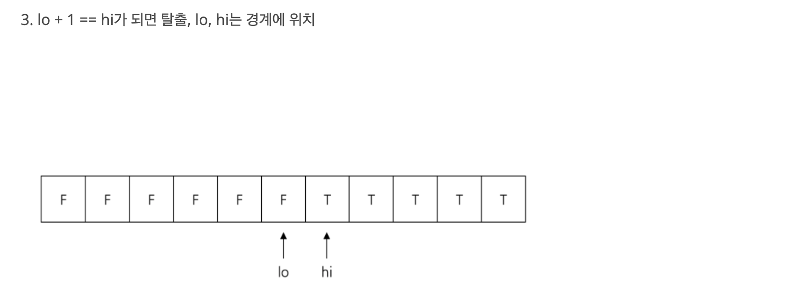
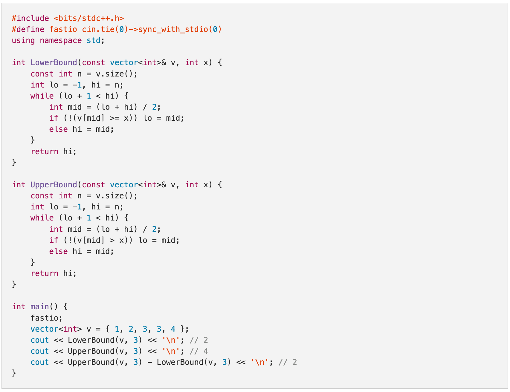

# day5. 이분 탐색(Binary Search)


최적해를 찾아야할때

전체 가능한 최적해의 집합을 생각해본다
그 집합의 원소, 후보해를 하나 고르고, 0~n, n~N 까지 양분해서 결과를 계산해본다

왼쪽, 오른쪽의 계산된 결과 중 더 최적에 근접한 쪽으로 범위를 옮겨 탐색해본다

이런식의 문제 해결이 가능하다면 이분 탐색 문제이다


항상 구간의 한쪽 끝은 조건을 만족하고, 반대쪽 끝은 조건을 불만족하는 형태를 유지해가며 구간을 좁혀나가다 보면 답을 찾을 수 있습니다.


중간값을 구하는 과정에서 오버플로우가 발생하지 않도록... 예를 들면 가능한 값이 21억 정도 된다면, 구간 [10억, 21억] 등의 중간값을 구하는 과정에서 오버플로우가 발생할 수도 있죠.


이분 탐색 문제는 무엇을 탐색할 것인지 생각하는 것이 가장 중요

보통 각 element의 크기가 탐색의 범위 자체가 되기 때문에 element의 크기 제한이 상당히 큰 편
그리고 element의 개념과 찾아야하는 해답의 개념이 같다
ex. 길이=길이, 예산=예산


# 이분탐색 다시 복습
> [이분 탐색(Binary Search) 헷갈리지 않게 구현하기](https://www.acmicpc.net/blog/view/109)

세 줄 요약
1. [lo, hi]가 Check(lo) != Check(hi)가 되도록 구간을 설정
2. while (lo + 1 < hi)동안 mid = (lo + hi) / 2에서 Check(mid) = Check(lo)라면 lo = mid, 아니라면 hi = mid
3. 구한 경계에서 답이 lo인지 hi인지 생각해보고 출력

왜 구한경계에서 lo, hi 중 무엇이 답인지 봐야할까?
lower bound, upper bound 의 차이는 수식으로 보면 등호가 어디있냐의 차이다


1. lower_bound는 v[i - 1] < k <= v[i]인 i를 찾아주는 함수로, k <= v[i]인 i의 최솟값을 반환합니다.
만약 v의 모든 원소가 k보다 작다면 v의 마지막 다음 칸의 위치를 반환합니다.

2. upper_bound는 v[i - 1] <= k < v[i]인 i를 찾아주는 함수로 k < v[i]인 i의 최솟값을 반환합니다.
이 경우에도 v의 모든 원소가 k보다 작거나 같다면 v의 마지막 다음 칸의 위치를 반환합니다.

예를 들어 n = 5, v = [1, 2, 3, 3, 4]일 때
lower_bound(v, v + n, 3)은 v[2] >= 3이기 때문에 2
upper_bound(v, v + n, 3)은 v[4] > 3이기 때문에 4


> 내가 기존에 외우고 있던 '등호'가 있는 쪽의 left or right를 출력한다는 것은 lower bound를 찾는 경우가 많았기 때문으로 보인다
> 내가 지금 찾고 있는게 lower bound인지, upper bound인지 알고있어야한다

{width="600" height="300"}

{width="800" height="500"}


## 2805번: 나무 자르기

M이 만족되었다고 바로 반환하면 안되고, 그 중에서도 높이가 가장 높은것, right bound를 출력해야한다

lb, rb 를 갱신시키는 로직 (+1, -1 하느냐 마느냐)
while 조건문에 == 를 넣느냐 마느냐에 따라서 답이 달라지니 형식을 잘 외워둬야 한다

```go
func step1(N int, M int, tree []int) (result int) {

	lb, rb := 0, max(tree...)

	for lb <= rb {
		mid := (lb + rb) / 2

		var answer = 0
		for i := range tree {
			answer += max(tree[i]-mid, 0)
		}

		if answer >= M {
			lb = mid + 1
		} else {
			rb = mid - 1
		}
	}
	return rb
}
```


## 2110번: 공유기 설치

이분 탐색 + 그리디

공유기는 최대한 많이 설치하는게 좋다
특정 길이 K 로 공유기를 설치했을때 더 많이 설치되었다면 길이를 늘린다. 더 적게 설치되었다면 길이를 줄인다

포인트는 첫번째 집에는 무조건 공유기를 설치한다는 것이다

길이 K를 정했다면, 검증 자체는 그리디하게 진행한다


공유기를 첫번째 집에 반드시 설치하고 진행하는 것은 잘 이해가 되지 않는다

첫번째 집에 설치하지 않는 해답이. 인접한 두 집의 최대 거리가 되는 상황은 없다는 것인가?


## 16434번: 드래곤 앤 던전

max HP 의 범위를 1~1e18 로 두고 이분 탐색

각 HP에서 가능한지를 O(N)에 확인 가능하다

O(log(HP)N)

* step1
	- 이분 탐색
* step2
	- 각 던젼방들이 입력될때마다 가능한 HP를 계산하고 늘려가면서 O(N)에도 해결이 가능하다


## 15732번: 도토리 숨기기

각 상자마다 도토리를 담아야하는 규칙에 해당하는지를 확인하는 식으로 해결한다면...
O(NK)

1000000 * 10000

마지막 도토리가 들어가는 상자의 번호 범위는 1 ~ 1000000 사이에 있다

125번째 상자가 정답인지를 확인하려면,

125번째 상자까지 도토리를 몇개 사용했는지를 확인해야 한다

100~150 10
110~150 15
규칙이라고 한다면

(min(150,125)-100)/10 -> 2.5
(min(150,125)-110)/15 -> 1

총 3개를 넣는다
근데 시작점에는 반드시 넣기 때문에 시작점보다 크다면 +1을 해주고 시작해야 한다
그래서 총 5개


## 1300번: K번째 수

정답의 범위는 1~N제곱 까지다.

이 역시 반대로 생각해야한다

K번째 수는 뭐야? -> a는 몇번째 수야?

a는 몇번째 수야? 를 해결하기 위해서 처음에는 뭔가 수학적인 방법을 떠올렸다.
수학적으로 a라는 수가 몇번째 수인지 O(1)에 해결할 수 있을까?

근데 보통은 이렇게 접근하기 보다는....a라는 수가 몇번째 수인지를 판단하는 brute force 방법을 먼저 떠올려보자

N * N 배열을 순회하면서 a보다 작은 수의 개수를 세본다
N^2 방법이기도 하고...배열 크기가 10^5 이라서 배열로 생성이 불가능하다고 한다

N번 만에 확인할 수는 없을까?

N이라고 하면 각 row를 순회하는거잖아

각 row에서 a보다 작은 수의 개수를 O(1)에 해결할 수 있을까?

각 row에는 1 * 1 ~ 1 * N 까지의 수가 있다. 이때 mid 값보다 작은 수는 몇개인가?

min(N, mid/i)가 된다

이렇게 a 보다 작은 수의 개수를 O(N)에 해결 가능하다

그러면 이 알고리즘은 O(logN * N) 이 된다


이때 중요한 것은 작은 수의 개수를 센거기 때문에, K번째 수가 아니라 K-1번째 수 라는 뜻이 된다.

그래서 K-1 과 작은수의 개수를 비교해야 한다 (특히 equal 비교할때 주의)


1. K번째 수는 뭐야? -> a는 몇번째 수야?
2. a라는 수가 몇번째 수인지를 판단하는 brute force 방법을 먼저 떠올려보자
3. N * N 배열을 순회하면서 a보다 작은 수의 개수를 세본다 -> N^2
4. N번 만에 확인할 수는 없을까? N이라고 하면 각 row를 순회하는거잖아
5. 각 row에서 a보다 작은 수의 개수를 O(1)에 해결할 수 있을까?
6. 각 row에는 1 * 1 ~ 1 * N 까지의 수가 있다. 이때 mid 값보다 작은 수는 몇개인가? min(N, mid/i)가 된다 이렇게 a 보다 작은 수의 개수를 O(N)에 해결 가능하다. O(logN * N)


