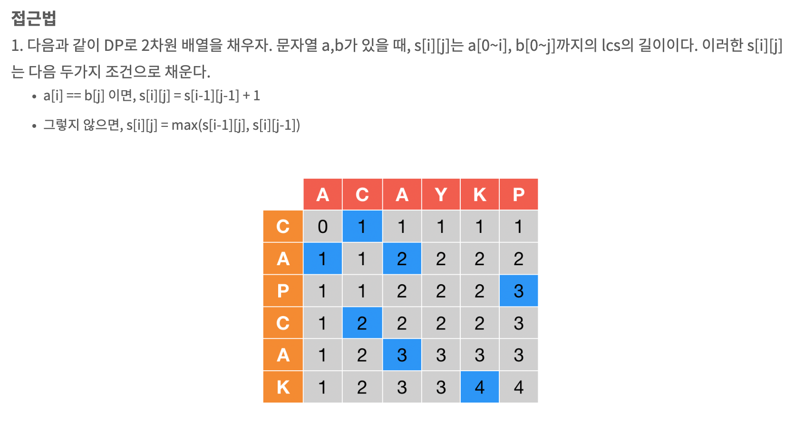
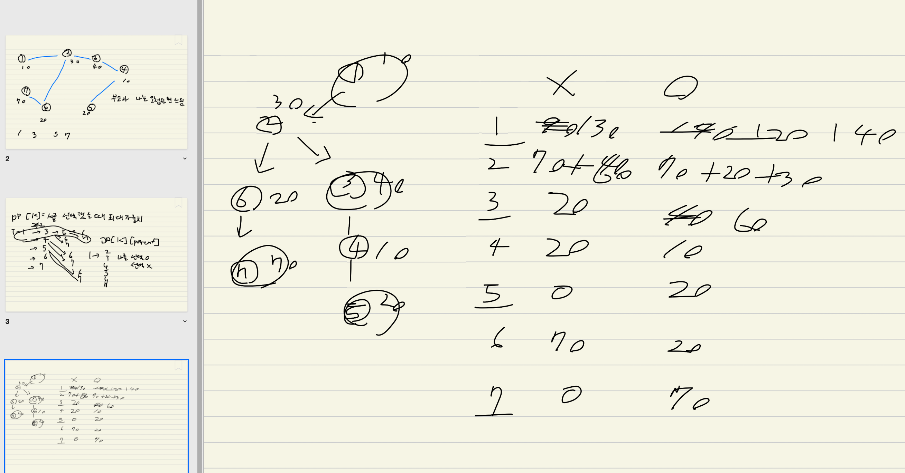
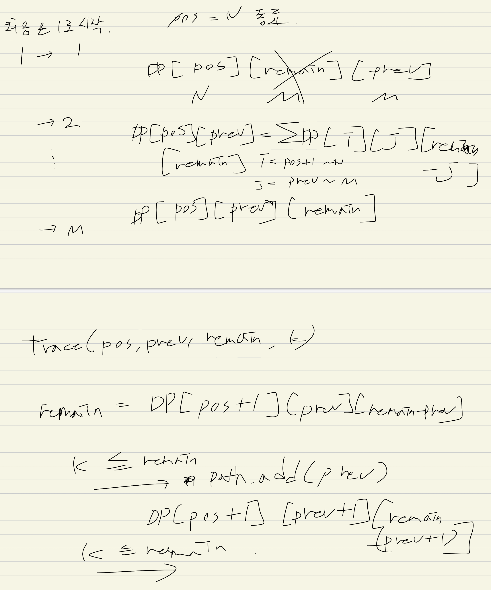

# day19. 동적 계획법 2(Dynamic Programming 2)

DP로 문제를 해결한뒤 각 요소들에 무엇이 있는지 출력하는. 역트래킹이 필요한 문제들이 있다

동전, 타일 같은 DP 문제에는 적응했다고 생각했는데 엄청 다양한 DP 문제들이 있다
어느정도 greedy한 접근도 필요하다


* 최적의 답을 찾고. 그 구성요소를 출력
* K번째 구성요소를 출력

* LCS
	- LCS 요소 출력
	- DP(문자열A의 마지막 위치. i)(문자열B의 마지막 위치. j)
* 트리DP
	- 인접한 두 정점을 선택 / 인접하지 않은 두 정점을 선택
		+ 현재 서브트리의 루트 번호 / 부모를 선택했는지. 2차원 DP
	- 선택된 정점 출력
	- DP(node)(is_select)
* 자물쇠DP
	- 0~9 까지의 숫자를 가진 원형 자물쇠를 돌리는 문제
	- DP(pos)(offset)
* 이항계수DP
	- 조합의 K 번째 조합을 출력하는 문제
	- DP(n)(r)
	- 파스칼의 삼각형
	- 분기의 경우가 2가지인 경우. 선택하고/안하고
* 이항계수DP2
	- DP(n)(r)
	- 최대 r개를 선택하는 문제
	- 기저가 n==0 / r==0 이 된다
* 괄호문자열DP
	- DP(n)(open)(wrong)
	- 여는괄호의 개수가 음수도 허용하도록 padding 처리를 해야한다
	- 중간에 이미 괄호ㄴㄴ문자열인지를 알 수 있도록 flag 처리를 해야한다
* 수열DP
	- DP(pos)(remain)(prev)
* 가장 작은값 / 가장 큰 값
	- 작은값, 큰값을 꼭 동일한 알고리즘으로 계산해야할 필요는 없다
		+ 둘 중 하나는 쉽게 greedy로 가능?
	- 다른 알고리즘을 쓴다면 다른 data type을 쓸 수도 있을 것이다
	- top-down, bottom-up. 어느 것을 쓰냐에 따라서 로직이 유리한 경우가 있다


> 기본적인 DP 컨셉들이 이런 공통점이 있다 (선택하고/안하고..트리DP, 자물쇠DP, 이항계수DP, 괄호문자열DP)
> 1번째 파라미터는 전체 중에서 n개를 선택한 상황
> 2번째 파라미터는 그 중에서 option 1를 k개 선택한 상황

> 이항계수DP, 괄호문자열DP 같은 경우의 trace는 k번째 조합의 수를 찾는 것이다
> 작은것을 선택했을때의 가짓수와 현재 k 값을 비교하여 포함된다면 작은것을 선택하는식으로 진행한다

## 9252번: LCS 2

* LCS. LCS 요소 출력

LCS는 O(N^2)으로 해결 가능. 2차원 DP
2차원 DP의 경우 표를 그려보면 쉽게 보인다

왼쪽,위쪽
대각선 왼위쪽
이렇게 탐색 방향이 나뉜다

```java
    for (i in 0 until sequenceX.length) {
        for (j in 0 until sequenceY.length) {
            if (sequenceX[i] == sequenceY[j]) {
                DP[i+1][j+1] = DP[i][j]+1
            } else {
                DP[i+1][j+1] = max(DP[i+1][j], DP[i][j+1])
            }
        }
    }
```

{width="600" height="400"}

처음부터 시작해도 되고, 마지막에서 시작해도 되고
길이가 커지는, 작아지는 방향에서 대각선으로 이동하고 해당 위치에서의 알파벳을 출력하거나 저장한다
아니라면 위든 아래든 이동한다
(LIS에서 역트래킹하는 방법처럼)


## 2213번: 트리의 독립집합

트리에서 일부 노드를 선택시 인접한 노드를 선택할 수 있고, 선택할 수 없고. 그때 최대 선택을 할 수 있는 방법.
이런 문제는 웰논 문제라서 아예 외우고 있어야 한다

2차원DP. 현재 노드 i 에서 i 노드를 선택했을때 하위 노드들의 최대 합. 선택하지 않았을때 하위 노드들의 최대 합.으로 해결 할 수 있다
자신과 연결되지 않은 정점이라도, 트리이기 때문에 결국은 상위 노드에서 양쪽 노드가 모두 고려되어 진다

트리를 순회할때 parent 만 알고있으면 visit이 필요가 없다. 사이클이 존재하지 않아서!

자기자신을 선택했는지를 DFS 하면서 알필요가 없다.
결국 자신을 선택/선택안함.을 반복하면서 탐색을 그냥 쭉하고
자신의 DP 값을 변경할때 자신이 선택되어 있다면, 하위 정점에서는 선택되지 않은 것을 비교하면 된다


trace의 경우 선택한 정점과 선택하지 않은 정점간의 가중치에서 선택한 정점의 가중치가 더 크기 때문에, 양쪽 중 가중치가 큰 것을 따라가면 된다
이것 역시 트리라는 것을 명심하자

trace를 할때 트리의 순회가 중복이 발생하진 않지만, 트리 자체가 여러개의 모양일 수는 있다.
이때 DP 배열을 만들때 했었던 고민을 여기서도 다 해줘야하는데
이 트리DP에서 해줘야할 것은 부모가 선택되었다면 자신은 해답에 포함되는 정점이 될 수 없다는 것이다.
> 따라서 부모를 답에 넣었다면 자기 자신은 포함하는게 가중치가 더 크더라도 포함시키면 안된다

> DP 문제는 반드시 표로 그릴줄 알아야 한다

{width="600" height="400"}


## 2494번: 숫자 맞추기

단순히 DFS, BFS로 모든 탐색을 하겠다고 접근하는것 보다....

아래 나사들은 위 나사의 회전에 영향을 받지만, 위 나사는 위 나사를 돌려야만 답에 근접할 수 있다
따라서 위 부터 정답을 맞춰가는게 필요하다

숫자나사 1번부터, 
DP(digit)(offset)

현재것을 맞추기 위해서는 왼쪽, 오른쪽 2가지 선택지 밖에 없다

> current digit + offset 은 10을 넘어갈 수 있다
> 각 수식에서 모듈러 연산을 잘 적용해야 한다


## 1256번: 사전

선택지가 'a', 'z' 2개밖에없다.

전체 경우의 수는 몇가지 일까?
전체 N+M 개 중에서 'a'의 위치 N개를 고르는 문제이다
n+m C n -> K를 넘어가면 -1

이항계수는 DP를 이용해서 해결 가능하다

n+m C n = n+m-1 C n-1   +    n+m C n-1

현재 위치에서 'a'를 선택했다면 이후의 조합의 수(경우의 수)가 몇가지나 될까?
현재 k 번째 문자열을 구한다고 했을때. 'a'를 선택했을때 조합의 수가 k 보다 크다면 'a'를 선택헀을때에는 정답이 없다. 'z'를 선택해야한다
'a'를 선택했을때의 조합의 수가 k 보다 작거나 같다면. 현재 'a'를 선택해야 k 번째 문자열에 도달할 수 있다

> 다양한 DP문제가 등장하는데 trace 하는 방법은 똑같다.

> 중요한 포인트가 전체 조합의 수 200c100 이 long long 의 범위를 아득히 벗어나는데, K값에 제한이 있다
> 따라서 그 이상의 k번째 수를 구하는 입력은 주어지지 않는다
> 따라서 이 이상으로 'z'를 선택하는 trace가 발생하지 않으며, K 최대값 보다 큰 조합의 수는 그냥 최대값으로 취급해도 상관없다

## 2248번: 이진수 찾기

이항계수 DP인데..선택을 정확히 r개 해야하는게 아니라 최대 r개를 해야한다

1을 선택하는 것을 r번 가능하다고 하면...
이전에는 n==r 이면 가짓수 1개를 리턴했지만
이 경우에는. r을 선택하지 않는 경우가 가능하다
r을 선택할 수 없는 경우. r==0 인 경우가 가짓수 1개인거고. (나머지를 0으로 채울 수 밖에 없음)
n==0 인경우. 더 채우지 않아도 되는 상황.에서는 가짓수가 1개 (이부분은 상관없을듯. 0이든 1이든)

기저가 n==0, r==0 인 경우인 것이다

n==r 인 경우에도 1을 선택하거나, 1을 선택하지 않거나. 두 경우를 더해준다.

1을 선택했다면...나머지가 전부 1로 채워질 수도 있고 (이 경우에도 최대 L개를 넘진 않는다)
1을 선택하지 않는다면...이후에 몇개는 1이 될 수도 있고, 몇개는 0이 될 수도 있을것이다 (이 경우에도 최대 L개를 넘진 않는다)

## 1023번: 괄호 문자열

DP(pos)(open)

* 분기
	- base case
		+ 여는 괄호가 1개 이상이라면 +1
		+ 아니라면 +0
	- 여는 괄호를 쓴다
		+ 여는괄호를 하나 늘인다
	- 닫는 괄호를 쓴다
		+ 여는괄호를 하나 줄인다

이때 고민스러운 것이...
처음부터 닫는괄호로 시작하면 )))) 여는괄호만 체크해서는 닫는괄호가 몇개인지 알수가 없다
또한 처음에 닫는괄호로 시작하고 뒷부분은 괄호문자열이라면 )()() 괄호ㄴㄴ문자열인지 알수가 없다

따라서 여는괄호의 개수가 음수도 허용하도록 padding 처리를 해야한다
그리고 중간에 이미 괄호ㄴㄴ문자열인지를 알 수 있도록 flag 처리를 해야한다

DP(n)(open)(wrong)


중간에 wrong이 되는 순간 wrong을 1로 바꿔준다. 다시 0이 되는 순간은 없다
트레이싱 할때도 wrong이 되는 순간에는 wrong을 바꿔서 트레이싱해야한다

## 2291번: Sequence

{width="600" height="800"}

> 기저 케이스의 DP 배열도 1이든 0이든 갱신해줘야한다

DP(n)(m)(prev)
DP(pos)(remain)(prev)

트레이싱할때도 각 단계별 j를 찾아가야 한다


## 2201번: 이친수 찾기

현재 자릿수의 이전에 무엇을 선택했는지가 중요하다 (얼리어답터, RGB거리, 트리 선택하는 문제들처럼)

DP(n)(prev)

근데 자릿수가 정해지지 않았다

K가 100경 정도인데. Long 타입이 900경 정도니깐 Long 타입으로 가능하다
그리고 100경 정도면 2^60 정도라서 최대 자릿수가 60이라고 판단했다
근데 '11' 같은 이진수들이 빠지기 때문에 실제로는 60보다 자릿수가 더 커질수도 있다

그래서 100 정도로 가정하고 해결할 수 있을텐데...

처음에는 정확한 자릿수를 몰라도 100자리 이친수 중에서 K번째를 고르면 되지 않을까 생각했다
근데 100자리까지 가면 경우의 수가 최대 K를 넘어간다
그래서 100자리 수 부터 시작 해버리면 K 번째 수를 제대로 찾아갈 수 없다 (오버플로우 때문에 remain이 얼마인지 계산이 안된다)

그래서 정확히 그 자릿수에서 trace를 시작해야한다

dfs는 100자리 부터 시작해도 되지만, trace는 자릿수를 탐색해본 다음에 시작해야함


## 3687번: 성냥개비

0-9까지 성냥개비를 사용해보고 그중에서 가장 작은값, 큰값을 DP에 저장하면 된다

이떄....top-down. 재귀방식으로 하면 하위 방향에서 001, 08 같은 값이 나온다
001, 08 보다 8이 작은 값이지만 Long으로 비교하려면 1,8, 8 의 비교가 되버려서 의도하지 않은 결과가 나온다

String 으로 비교하는것도 앞의 0을 제거하고 비교해도, length 비교 -> 값 비교 순으로 해도 답이 나오지 않는다

이럴때는 bottom-up 방식. for-loop 방식으로 해결하면 이런 문제를 예방할 수 있다

이 문제에서 중요하게 생각해야 할 문제가 있는데...
* 성냥개비의 개수가 최대 100개이다. 가장 큰값을 만들려면 전부 1로 자리수가 50개나 된다. 이는 long 으로 표현할 수 없다
* 하지만 최소값을 만드는 것은 전부 8로 해보면 12.5가 나온다. long 으로 표현할 수 있다
* 가장 큰값은 greedy하게 7이나 1을 써서 자릿수만 왕창 늘려주면 된다.
	- 홀수면 7로 시작. 나머지는 1
	- 짝수면 1로 시작. 나머지는 1
* 가장 작은값을 DP로 풀면 되는데 Long 타입 사용 + bottom-up 방식으로 해결 가능하다


