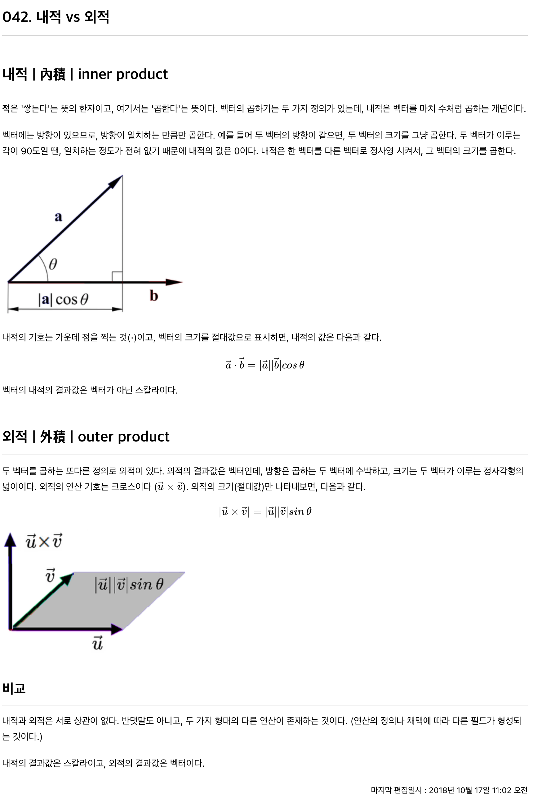
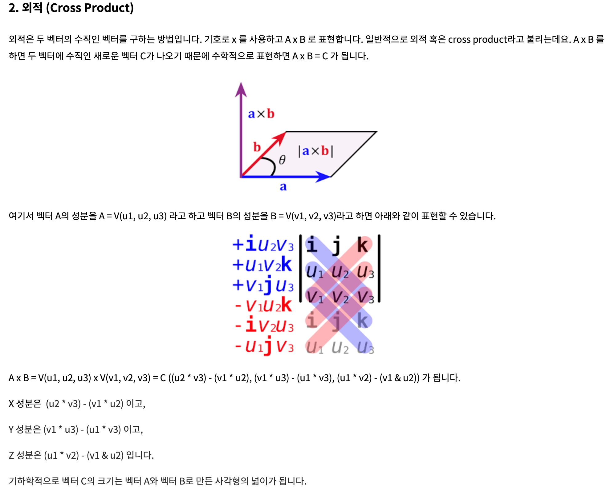
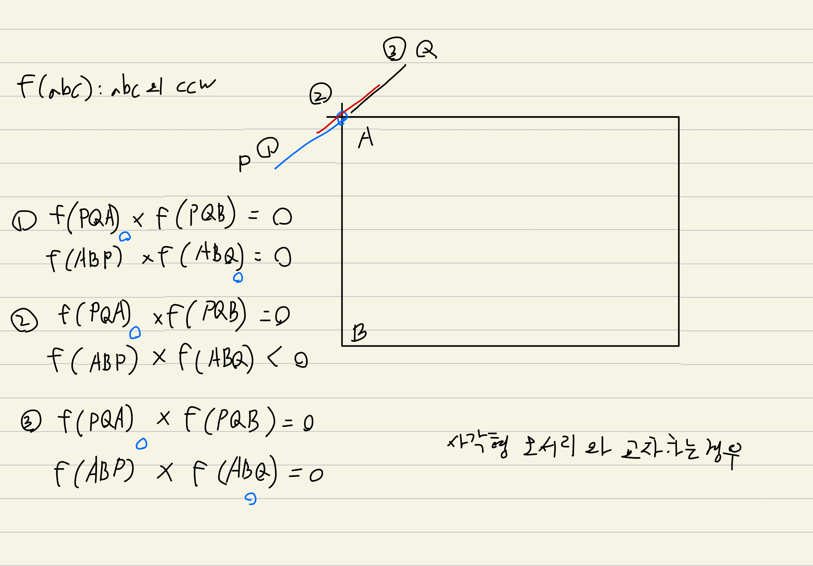
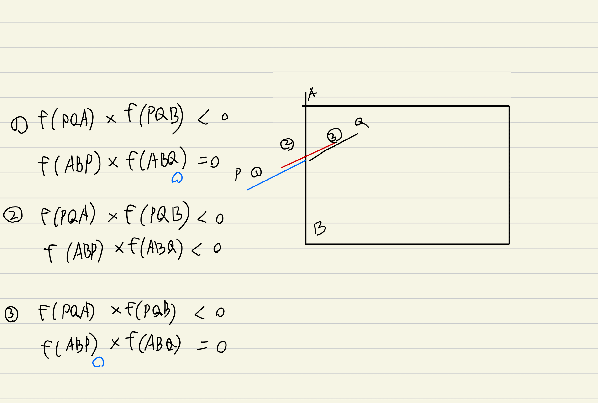

# day22. 기하 - 벡터의 활용(geometry)
> https://m.blog.naver.com/PostView.naver?blogId=kks227&logNo=220794097589&navType=by
> [수학 용어를 알면 개념이 보인다](https://wikidocs.net/22384)


* 세 점의 위치 관계. cw, ccw
	- 외적
* 다각형의 넓이
  - 외적
  - P1 ~ Pi,Pi+1. 세점들의 외적의 합 / 2. 가 전체 다각형의 넓이. 볼록/오목 다각형에 상관없음
* 두 선분의 교차 여부
	- 외적 4번 + 네 점이 일직선인 경우 예외처리
* 두 선분 사이의 거리
  - 점과 선 사이의 거리
	- 수직선을 내릴 수 있는지 확인 -> 내적
  - 수직선의 길이 계산 -> 외적
* 두 선분의 교차 지점 구하기
* 볼록 껍질 (Convex Hull)


두 선분(AB, CD) 간의 위치를 계산할때
ABC,ABD 벡터 외적
두개의 부호가 다름. 선분AB을 기준으로 점 C,D가 서로 반대 방향에 있음. 교차
하나만 0. 점이 하나만 겹침
둘다 0. 네 점이 일직선 상에 위치


https://velog.io/@jini_eun/%EB%B0%B1%EC%A4%80-1069%EB%B2%88-%EC%A7%91%EC%9C%BC%EB%A1%9C-Java-Python
17386 선분 교차 1
17387 선분 교차 2
20149 선분 교차 3
7869 두 원
x 1069 집으로


## 두 선분의 교차 여부

내적, 외적
'적'이라는 말이 '곱한다'라는 말이다
그래서 영어로 inner product, cross product 라고 한다

"내적은 한 벡터를 다른 벡터로 정사영 시켜서, 그 벡터의 크기를 곱한다"
내적의 결과값은 벡터가 아닌 스칼라이다

"외적은 방향은 두 벡터의 사이 방향이 되고, 크기는 두 벡터가 이루는 정사각형의 넓이다"
외적의 결과값은 벡터이다
외적은 교환법칙이 적용되지 않고, 방향이 반대가 된다
"두 벡터에 수직인 벡터를 구한다던지, 한 평면의 법선벡터(수직인 벡터)를 구할때 유용하다"

외적과 내적은 서로 상관이 없다. 그냥 다른 연산이다

{width="800" height=900"}

{width="800" height=600"}

1. 반시계 방향인 경우. S가 0보다 크면
2. 시계 방향인 경우. S가 0보다 작으면
3. 세 점이 평행한 경우. S가 0이면

 `CCW(A,B,C) * CCW(A,B,D)<=0 이면서 CCW(C,D,A) * CCW(C,D,B)<=0`
위 수식으로도 반례가 있다. 
CCW(A,B,C) * CCW(A,B,D) == 0 && CCW(C,D,A) * CCW(C,D,B) == 0 인 경우


## 11758번: CCW

점 3개가 주어졌을떄, P1, P2, P3 순서대로 이은 선분이 어떤 방향을 이루고 있는지?

P1P2 방향벡터와 P1P3 방향벡터의 "벡터의 외적"으로 확인한다

양수면 CCW, 음수면 CW, 0이면 같은 방향/역방향


## 2166번: 다각형의 면적

P1을 기준으로 P2 ~ PN 까지의 벡터 외적의 합으로 볼록/오목 다각형의 넓이를 계산할 수 있다

벡터 외적의 절대값은 두 방향벡터가 이루는 평행사변형의 넓이와 같기 때문에
벡터 외적의 합을 나누기 2 해준 값은 전체 다각형의 넓이와 같다

이때 오목 다각형의 경우 자연스럽게 음수 넓이가 발생하고 빠져야 할 부분들이 빠지기 때문에 고려하지 않아도 된다


## 연돌이와 고잠녀

* 두개의 좌표로 방향벡터를 만드는 법

총이 날라가야 하는 지점 - 캐릭터 좌표
입니다.
단순히 방향만 필요하면 결과를 단위벡터로 만드시면 되고
거리를 구하려면 결과 벡터의 길이를 구하면 됩니다.

* A와 B의 내적은 대응하는 성분끼리 곱한 다음 모두 더한 값으로, 결과는 스칼라이다.


N 최대 2000이라서 N^2 으로 모든 선분 간의 최소 거리를 계산하면 된다

두 선분 간의 최소 거리는
P1, P2, P3, P4

1. 점들간의 거리 비교
  * P1 - P3
  * P1 - P4
  * P2 - P3
  * P2 - P4
2. 점과 선분간의 거리 비교
  * P1P2 - P3
  * P1P2 - P4
  * P3P4 - P1
  * P3P4 - P2

점과 선분간에 수직선이 존재할 수 있는지는 "벡터의 내적"으로 판단한다
수직선이 존재할 수 있다면 "벡터의 외적"으로 수직선의 길이을 계산한다

두 벡터가 이루는 각이 예각이라면 벡터의 내적은 양수이다
P1P2P3 일때

각 P3P1P2
각 P1P2P3
두 각도 모두 예각이라면 P3는 P1P2 선분에 수직선을 내릴 수 있다

> 따라서 P1P2 * P1P3 벡터의 내적과 P2P1 * P2P3 벡터의 내적의 곱이 0 모두 크다면 (둘다 음수가. 둘다 둔각이 될 수는 없다) 수직선이 존재 할 수 있다

P1P2P3
벡터의 외적의 절대값은 두 벡터가 이루는 평행사변형의 넓이이기 때문에 P2P3 길이로 나눠주면 수직선의 길이를 알 수 있다
(마름모의 넓이 공식은 대각선 * 대각선 / 2)


## 10255: 교차점

두 선분(AB, CD) 간의 위치를 계산할때
ABC,ABD 벡터 외적
두개의 부호가 다름. 선분AB을 기준으로 점 C,D가 서로 반대 방향에 있음. 교차
하나만 0. 점이 하나만 겹침
둘다 0. 네 점이 일직선 상에 위치


무수히 겹치는 구간은 선분이 가로선이냐 세로선이냐로 나눠서 하드코딩하는게 편하다


1. 선분0과 직사각형 선분1,2,3,4가 서로 교차하는 포인트가 하나도 없는지를 확인
2. 선분0이 가로선/세로선이냐에 따라서 무수히 겹치는 구간이 있는지 확인
3. 교차하는 구간 확인
  * 사각형 모서리와 교차하는 구간 확인 (이 부분은 0.5씩 반영)
  * 사각형 선분과 교차하는 구간 확인

{width="600" height=500"}

{width="600" height=500"}


## 2162번: 선분 그룹

두 선이 교차하는지 확인 + union_find

두 선이 교차하는지를 확인하는 ccw 함수를 아래와 같이 작성했는데 메모리 초과가 발생한다
ccw 계산할때는 그냥 바로 계산하자

* 메모리 초과
```java
private fun crossProductForPoint(x1: Double, y1: Double, x2: Double, y2: Double, x3: Double, y3: Double): Double {
    val (P1P2_x, P1P2_y) = (x2-x1 to y2-y1)
    val (P1P3_x, P1P3_y) = (x3-x1 to y3-y1)
    return (P1P2_x * P1P3_y) - (P1P2_y * P1P3_x)
}
```

* 정상
```java
private fun ccw(x1: Double, y1: Double, x2: Double, y2: Double, x3: Double, y3: Double): Double {
    return x1*y2 + x2*y3 + x3*y1 - (y1*x2 + y2*x3 + y3*x1)
}
```

`cross1 * cross2 == 0.0 && cross3 * cross4 == 0.0`
네 점이 일직선 상에 존재하는 케이스
겹치는 부분이 있는지를 최대, 최소 점이 상대 선분 사이에 위치하는지로 확인한다

```java
            if (cross1 * cross2 == 0.0 && cross3 * cross4 == 0.0) {
                if (max(x1, x2) < min(x3, x4) || max(y1, y2) < min(y3, y4)) {
                    continue
                }
                if (max(x3, x4) < min(x1, x2) || max(y3, y4) < min(y1, y2)) {
                    continue
                }
                union(i, j)
                continue
            }

            if (cross1 * cross2 <= 0.0 && cross3 * cross4 <= 0.0) {
                union(i, j)
                continue
            }
```

## 16491번: 대피소 찾기

완전탐색을 한다고 하면...

로봇 10개. 대피소 10개

로봇1번을 대피소1번에 매칭

line(로봇x, 로봇y, 대피소x, 대피소y)

로봇2번을 대피소2번에 매칭
실패하면 대피소3번에 매칭


DFS(current, selectedLine, visit)

두 선분이 교차하는지 확인


N 제한이 10 이기 떄문에
완전탐색으로 모두 탐색해보면 된다. N!


## 17386 선분 교차 1
## 17387 선분 교차 2

ccw 반환값으로 cross1 * cross2 를 계산할때 overflow가 일어날 수 있다
단순히 선분의 교차만 보고 싶다면 ccw의 반환값을 -1,0,1 로 제한할 필요가 있다

## 20149 선분 교차 3

선분이 교차하는지를 보는 것 뿐만 아니라

1. 두 선분의 겹치는 부분이 한 점인지 무수히 많은지를 판단해야 한다
2. 두 선분이 교차점을 출력해야 한다

두 선분의 교차점은 아래와 같은 공식에 의해 구할 수 있다

```java
private fun getIntersectPoint(x1: Long, y1: Long, x2: Long, y2: Long, x3: Long, y3: Long, x4: Long, y4: Long): DoubleArray {
    // http://www.gisdeveloper.co.kr/?p=89
    val under = (y4-y3) * (x2-x1) - (x4-x3) * (y2-y1)

    val _t = (x4 - x3) * (y1 - y3) - (y4 - y3) * (x1 - x3)
    val _s = (x2 - x1) * (y1 - y3) - (y2 - y1) * (x1 - x3)

    val t = _t.toDouble() / under.toDouble()
    val s = _s.toDouble() / under.toDouble()

    val x = x1 + t * (x2 - x1).toDouble()
    val y = y1 + t * (y2 - y1).toDouble()

    return doubleArrayOf(x, y)
}
```
> http://www.gisdeveloper.co.kr/?p=89


문제는 두 선분의 겹치는 부분이 정확히 한점인지 파악하는 것이다

4개의 점이 일직선 상에 존재할때를 아래와 같이 판단한다
```java
        // 4개의 점이 일직선 상에 존재할때
        if (cross1 == 0L && cross2 == 0L && cross3 == 0L && cross4 == 0L) {
```

이때 각 선분의 한개 점씩이 일치할때 나머지 한점이 상대 선분의 내부에 존재해서는 안된다

이때 첫번째 선분이 두번째 선분보다 더 작을 수도 (포함될수도) 더 길 수도(두번째 선분이 포함될수도) 있기 때문에
첫번째 선분의 나머지 한 점이 두번째 선분 내부에 있는지
두번째 선분의 나머지 한 점이 첫번째 선분 내부에 있는지. 2번 계산해줘야 한다
2가지 경우 모두 아니라면 외부에 있는 것이라서. 각 점 1개씩이 겹치는 경우이다


