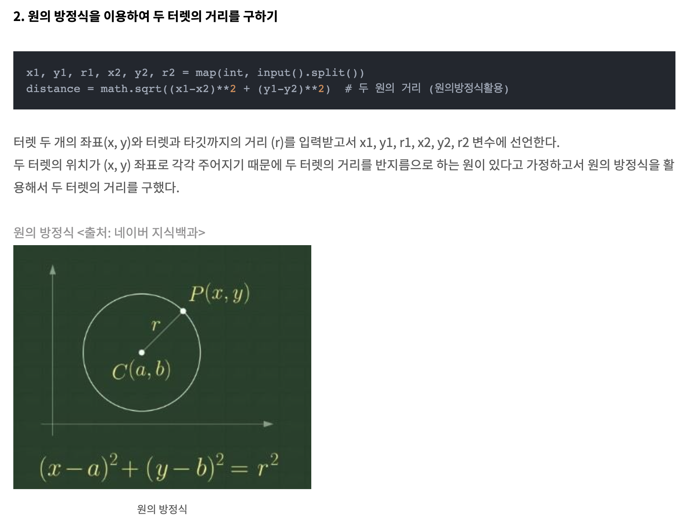
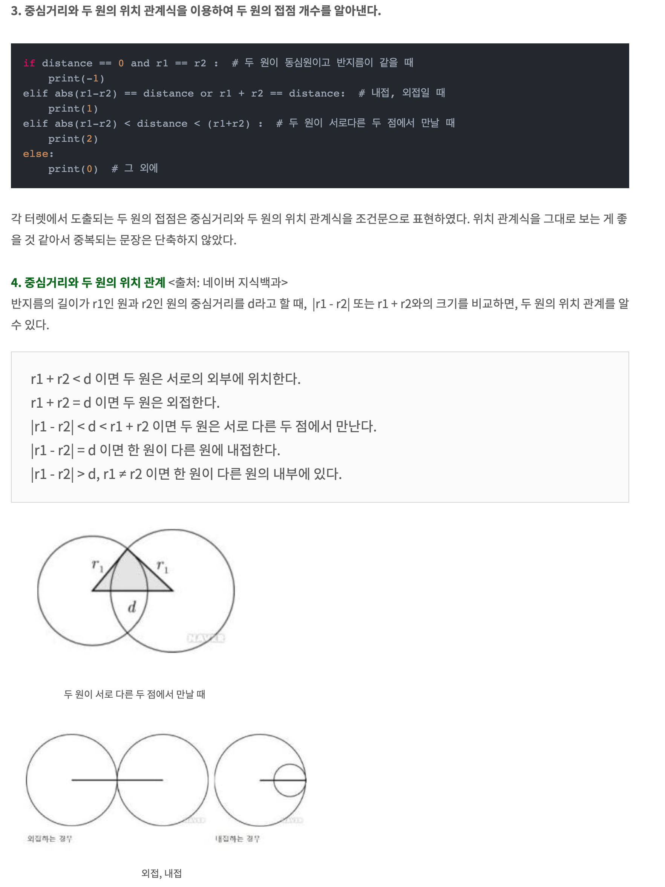

# 번외3. 기하(Geometric)


* [x] 직선의 방정식 개념 정리
* [x] 두 직선의 위치 관계
* [x] 점과 직선 사이의 거리 공식 및 증명
* [x] 두 직선의 방정식의 교점 구하기
* [x] 두 점 사이의 각도
  - atan2(y2-y1, x2-x1)
  - radian 각도를 degree 각도로 변환하는법
    + radian = atan2(y2-y1, x2-x1)
    + degree = (radian * 180) / math.pi
* [x] 두 원의 위치 관계, 원과 점의 위치 관계 
* [ ] 벡터
  * https://www.youtube.com/watch?v=1m8lR3EJ2iA&list=PLXJ3W1lEGK8UW-_e2bNY6Sy1siyc7yFV9&index=15
* [ ] 삼각함수
* [ ] 원, 타원
  * 두 원의 겹치는 영역의 넓이 구하기](https://wondangcom.com/1900)


## 직선의 방정식 개념 정리
> https://www.youtube.com/watch?v=OaGiySk7x9Q

* 개념1: y = mx + n의 그래프
* 개념2: 한 점과 기울기가 주어진 직선의 방정식
* 개념3: 좌표축에 평행한 직선의 방정식
* 개념4: 두 점을 지나는 직선의 방정식
* 개념5: x절편과 y절편이 주어진 직선의 방정식
* 개념6: 일차방정식 ax+by+c=0 이 나타내는 도형

### 개념1: y = mx + n의 그래프

직선의 기울기 = 직선의 기울어진 정도

= y의 증가량 / x의 증가량

왜?

x가 1만큼 증가했을때, y가 얼만큼 증가할까? 라는게 기울기이다

y2-y1 = 4, x2-x1 = 2 일때,
4/2 = 2 라서, x가 1만큼 증가할때 y가 2만큼 증가한다는 것을 알 수 있다.
그래서 y의 증가량을 x의 증가량으로 나눠주면 기울기가 된다


직선의 방정식
y = mx + n
특히, y = mx + n이 x축의 양의 방향과 이루는 각을 세타라 하면
m = tan세타

{width="600" height=300"}

### 개념2: 한 점과 기울기가 주어진 직선의 방정식

{width="600" height=400"}
 
### 개념3: 좌표축에 평행한 직선의 방정식

{width="600" height=150"}


### 개념4: 두 점을 지나는 직선의 방정식

{width="600" height=400"}

### 개념5: x절편과 y절편이 주어진 직선의 방정식

{width="600" height=350"}

### 개념6: 일차방정식 ax+by+c=0 이 나타내는 도형

{width="600" height=200"}


## 두 직선의 위치 관계
> https://www.youtube.com/watch?v=sW4_PgKLe2o

1. 평행
2. 일치
3. 한 점에서 만난다
  * 수직으로 만난다
  
평행 -> 두 직선의 기울기가 같아. y절편이 다르다
일치 -> 두 직선의 기울기가 같다. y절편도 같다
한 점에서 만난다 -> 두 직선의 기울기가 다르다

한 점에서 만나고 수직으로 만난다

두 직선을 원점으로 가지고 와서 피타고라스 공식(직각 삼각형에서 두 변을 이용하여 빗변의 길이를 구하는 공식)을 이용하여 만나는 각도가 직각인지 아니지를 확인할 수 있다

> 기울기의 곱이 -1 이라면 두 직선이 수직으로 만난다

{width="600" height=300"}

## 점과 직선 사이의 거리 공식 및 증명

점과 직선사이의 거리란, 점에서 직선에 내린 수선의 발의 길이
> 기하 문제로 나오는 것은 대부분 선분과 점이 주어지기에 예외처리가 필요한 부분이 있다
> 벡터를 안다면 점과 선분 사이의 거리는 벡터의 외적으로 계산할 수도 있다

공식은 이렇다

{width="600" height=300"}

{width="600" height=300"}


### 두 직선의 방정식의 교점 구하기
> https://gaussian37.github.io/math-algorithm-intersection_point/

두 선분의 교점을 구하는 방법에 대해서 알아본다

손으로 계산할때는 두 일차방정식을 연립방정식으로 쉽게 해결할 수 있습니다.
(두 일차방정식의 한쪽 차수를 맞춰주고 둘의 차를 구해 x좌표 혹은 y좌표를 특정한다)

두 선분의 교차여부가 확인된다면 교점을 구할 수 있다
PS에서는 점의 좌표 4개가 주어졌을때의 교점 공식이 유용할것 같다
(다른 코드는 링크 확인)

* 점의 좌표 4개가 주어졌을 때, 교점
* 표준형 식에서의 교점
* 일반형 식에서의 교점

{width="700" height=300"}

결국 아래와 같이 계산하는 것과 같다

```java
private fun getIntersectPoint(x1: Long, y1: Long, x2: Long, y2: Long, x3: Long, y3: Long, x4: Long, y4: Long): DoubleArray {
    // http://www.gisdeveloper.co.kr/?p=89
    val under = (y4-y3) * (x2-x1) - (x4-x3) * (y2-y1)

    val _t = (x4 - x3) * (y1 - y3) - (y4 - y3) * (x1 - x3)
    val _s = (x2 - x1) * (y1 - y3) - (y2 - y1) * (x1 - x3)

    val t = _t.toDouble() / under.toDouble()
    val s = _s.toDouble() / under.toDouble()

    val x = x1 + t * (x2 - x1).toDouble()
    val y = y1 + t * (y2 - y1).toDouble()

    return doubleArrayOf(x, y)
}
```
> http://www.gisdeveloper.co.kr/?p=89


## 두 점 사이의 각도

1 radian = 57.2958 degree
호의 길이가 반지름과 같게 되는 만큼의 각을 1 라디안(radian)이라고 정의


```python
            radian = atan2(y2-y1, x2-x1)
            degree = (radian * 180) / math.pi
            if degree < 0:
                degree += 360
```

여기서는 각도가 음수가 나오면 계산이 복잡해져서 360도 기준으로 각도가 형성되게 조정한다


## 두 원의 위치 관계, 원과 점의 위치 관계

```python
                # 두 원의 거리
                distance = math.sqrt((x1-x2)**2 + (y1-y2)**2)

                if distance == 0 and r1 == r2:
                    # 두 원이 동심원
                    edges[i].append(j)
                    edges[j].append(i)
                elif r1 + r2 == distance:
                    # 두 원이 외접
                    continue
                elif abs(r1-r2) == distance:
                    # 두 원이 내접
                    edges[i].append(j)
                    edges[j].append(i)
                elif abs(r1-r2) < distance < r1+r2:
                    # 두 원이 서로 다른 두 점에서 만남
                    edges[i].append(j)
                    edges[j].append(i)
```

* 힌 원과 한 점의 위치 관계
```python
                # 두 원의 관계로 생각하지 말고..한 점이 원 내부에 존재하는지를 확인하자. 이게 더 간단하다
                if i == j: continue
                distance = math.sqrt((x1-x2)**2 + (y1-y2)**2)
                if distance <= r1:
                    edges[i].append(j)
```

{width="700" height="500"}
{width="700" height="800"}


