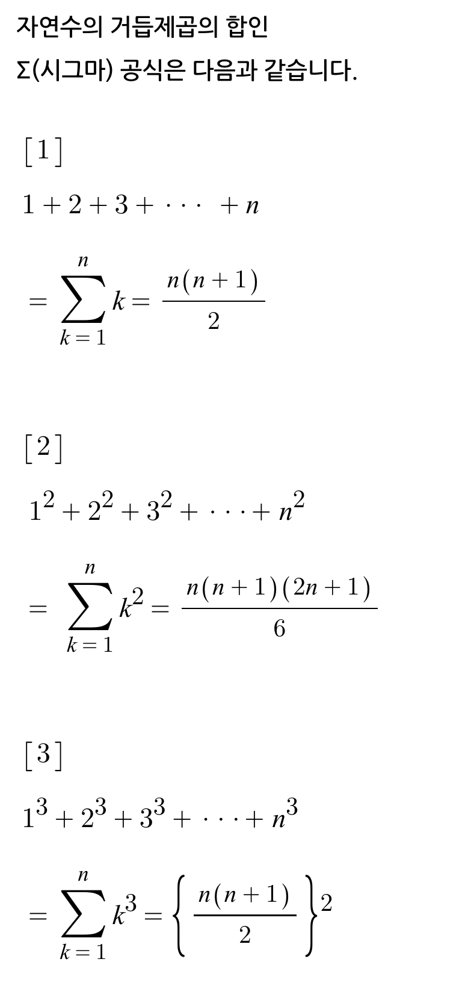
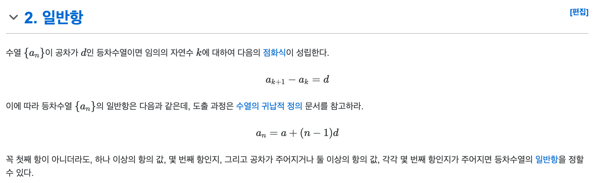
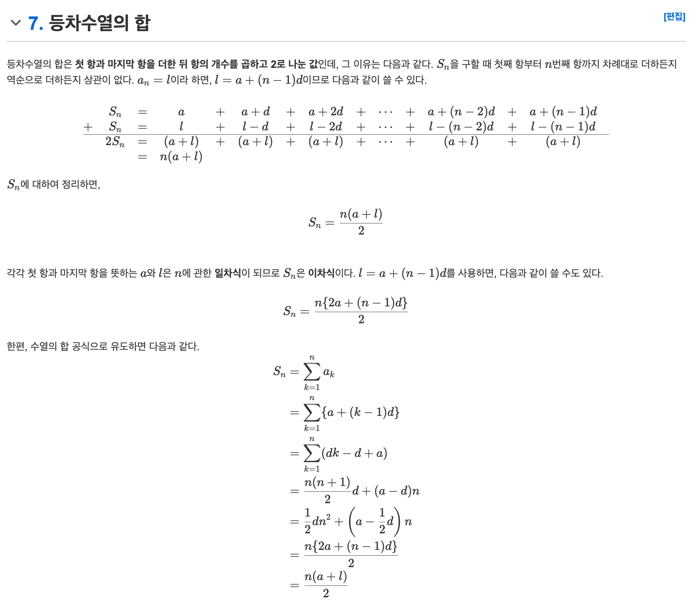
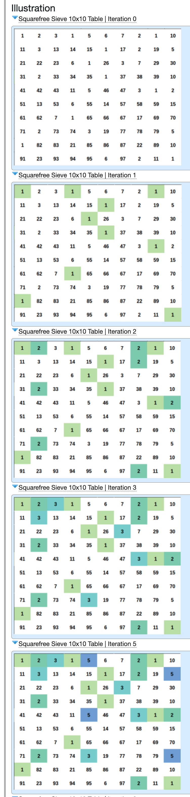
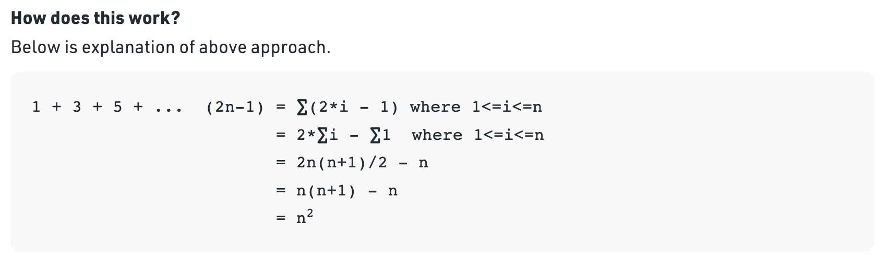
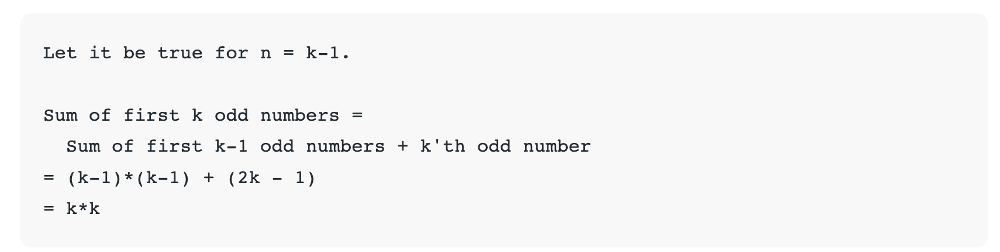
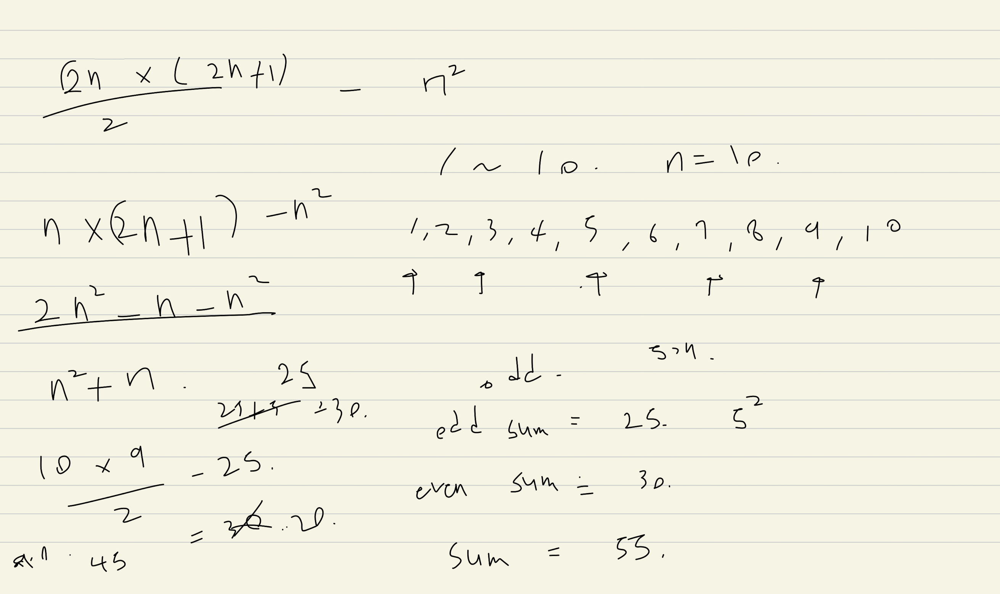
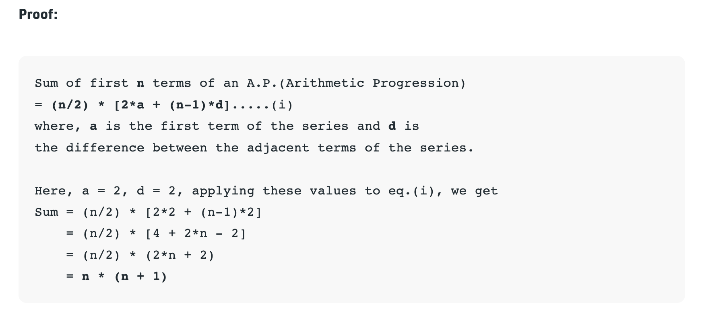
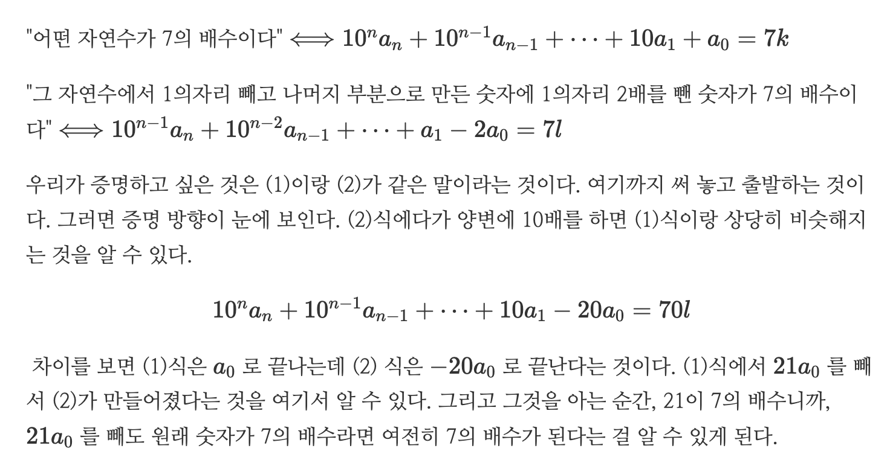
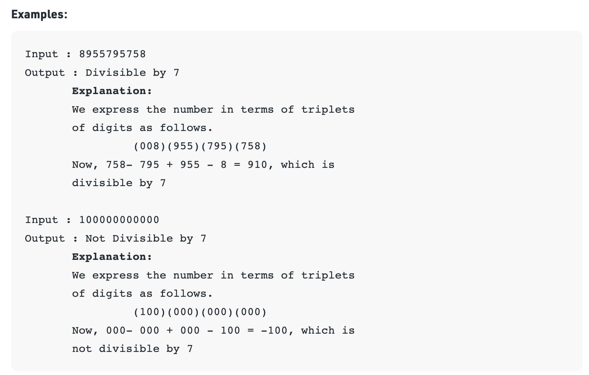

# 번외4. 수학(Math).md


- [소인수분해](#-----)
  * [최대공약수 GCD Greatest Common Divisor, 최소공배수 LCM Least Common Multiple](#------gcd-greatest-common-divisor--------lcm-least-common-multiple)
  * [약수의 개수](#------)
  * [x, y 모두로 나누어 떨어지는 수의 개수, x로 나누어 떨어지지만 y로 나누어 떨어지지 않는 수의 개수](#x--y---------------------x------------y-------------------)
- [수열](#--)
  * [수열의 합](#-----)
  * [등차수열 Arithmetic Progression. A.P](#-----arithmetic-progression-ap)
- [완전제곱수 perpect squre. 제곱인수가 없는 수 sqaure-free integer](#------perpect-squre------------sqaure-free-integer)
  * [Count of pairs in an array whose product is a perfect square](#count-of-pairs-in-an-array-whose-product-is-a-perfect-square)
  * [Count of pairs in an array whose sum is a perfect square](#count-of-pairs-in-an-array-whose-sum-is-a-perfect-square)
  * [Print all perfect squares from the given range](#print-all-perfect-squares-from-the-given-range)
  * [Check perfect square using addition/subtraction](#check-perfect-square-using-addition-subtraction)
    + [Sum of first n odd numbers in O(1) Complexity](#sum-of-first-n-odd-numbers-in-o-1--complexity)
    + [Sum of first n even numbers](#sum-of-first-n-even-numbers)
  * [Number of perfect squares between two given numbers](#number-of-perfect-squares-between-two-given-numbers)
  * [Check if given number is perfect square](#check-if-given-number-is-perfect-square)
- [나누어 떨어지는 수](#----------)
  * [7, 11, 13 배수 판별법 및 그 증명](#7--11--13--------------)
  * [To check whether a large number is divisible by 7](#to-check-whether-a-large-number-is-divisible-by-7)
  * [Count numbers in range 1 to N which are divisible by X but not by Y](#count-numbers-in-range-1-to-n-which-are-divisible-by-x-but-not-by-y)
  * [Super Niven Numbers](#super-niven-numbers)
  * [Sum of first N natural numbers which are divisible by 2 and 7](#sum-of-first-n-natural-numbers-which-are-divisible-by-2-and-7)


## 소인수분해

### 최대공약수 GCD Greatest Common Divisor, 최소공배수 LCM Least Common Multiple

최대공약수는 유클리드 호제법으로 계산 가능
O(logN)

* GCD(A,B) = GCD(B, A%B)
* LCM = 두 자연수의 곱 / GCD

### 약수의 개수

공약수의 개수 = 최대공약수의 약수의 개수
약수의 개수 = 소인수분해시 약수들의 (지수+1)들의 합

### x, y 모두로 나누어 떨어지는 수의 개수, x로 나누어 떨어지지만 y로 나누어 떨어지지 않는 수의 개수

1~N 까지의 수 중에서 x로 나누어 떨어지는 수의 개수는 N / x
1~N 까지의 수 중에서 x 혹은 y로 나누어 떨어지는 수의 개수는 N / LCM(x,y)

divisibleByXorY = (divisibleByX + divisibleByY - divisibleByLCM)
divisibleByXnotY = (divisibleByXorY - divisibleByY)


## 수열

### 수열의 합

시그마 공식

{width="300" height="550"}


### 등차수열 Arithmetic Progression. A.P

{width="700" height="250"}

{width="700" height="700"}


## 완전제곱수 perpect squre. 제곱인수가 없는 수 sqaure-free integer

### Count of pairs in an array whose product is a perfect square
> https://www.geeksforgeeks.org/count-of-pairs-in-an-array-whose-product-is-a-perfect-square

> keyword: perpect square, sqaure-free integer, seive of sqaure-free integer
> 완전제곱수, 제곱인수가 없는 정수, 제곱인수가 없는 정수의 채, 뫼비우스 함수

배열에 포함된 두 수(pair)를 곱해서 완전 제곱수(perpect square)가 되는 경우의 수를 카운팅하는 문제

완전 제곱수를 이루는 구성요소는 무엇일까?

x * y = z
(z is perpect square)

every positive integer,
x = u * p^2 으로 표현할 수 있다
(u는 제곱 인수가 없는 정수(square-free integer) 중 가장 작은 수)

따라서 x * y = perpect square가 되려면
x = u * p^2
y = v * q^2
u * v * p^2 * q^2 = perpect square를 만족해야한다

이러한 u,v 중에서 squarefree를 만족하면서 가장 작은 수가 되려면
u = v 일때만 만족한다

따라서 어떠한 positive integer x, y에 대해
u * p^2 으로 표현했을때, u = v 가 동일한 x, y 쌍은 그 곱이 perpect square를 만족한다는 것이다

따라서 sqaure-free integer 테이블을 만들고, array의 모든 수를 square-free integer(u)로 변환한다. (등장 횟수를 카운팅한다)
같은 square-free integer로 변환이 되는 수들끼리는 그 곱이 perpect square가 된다
따라서 square-free integer 중, 빈도가 2개 이상인 경우에는 pair를 만들 수 있다.
빈도가 n개라면, 그 쌍은 n * (n-1) / 2 개가 된다

에라토스테네스의 채 방식으로 구현하면 N log(logN)
뫼비우스 함수로 구현하면 N

{width="400" height="1200"}


### Count of pairs in an array whose sum is a perfect square
> https://www.geeksforgeeks.org/count-of-pairs-in-an-array-whose-sum-is-a-perfect-square/


배열에 포함된 두 수(pair)를 더해서 완전 제곱수(perpect square)가 되는 경우의 수를 카운팅하는 문제

두수의 합으로 가능한 완전 제곱수까지를 미리 구해둔다

a1 + a2 = perpect square
perpect square - a1 = a2 가 성립한다

따라서 a1에 대해 모든 perpect square의 차가 arr에 존재하는지 (이것은 hashmap으로) 확인한다

이 해법은 N * sqrt(N)

> 아래는 이 문제를 최초로 접했던 code signal 문제
문제를 다시 읽어보니, 최대 완전제곱수는 2 * 10^2 까지 가능한 것 같은데?
4 * 10^4 까지 범위를 할당해서 시간초과가 발생한것 같다 ㅜㅜ

> 근데 두개의 더해서까지가 범위니깐, 4 ^ 10^4 까지가 맞는듯!?!?


```
An integer n is called a full square, if there exists some integer s, such that n = s * s. Examples of full squares are 0, 1, 4, 9, 16, etc.

Given an array of distinct integers numbers, your task is to find the number of pairs of indices (i, j) such that i ≤ j and the sum numbers[i] + numbers[j] is a full square.

Example

For numbers = [-1, 18, 3, 1, 5], the output should be solution(numbers) = 4.

There is one pair of indices where the corresponding elements sum up to 0:

(0, 3): numbers[0] + numbers[3] = -1 + 1 = 0.
There are two pairs of indices where the corresponding elements sum up to 4:

(0, 4): numbers[0] + numbers[4] = -1 + 5 = 4;
(2, 3): numbers[2] + numbers[3] = 3 + 1 = 4.
There is one pair of indices where the corresponding elements sum up to 36:

(1, 1): numbers[1] + numbers[1] = 18 + 18 = 36;
In total, there are 1 + 2 + 1 = 4 pairs summing up to full squares.

For numbers = [2], the output should be solution(numbers) = 1.

The only pair of indices is (0, 0) and the sum of corresponding elements is equal to numbers[0] + numbers[0] = 2 + 2 = 4, which is a full square. So the answer is 1.
For numbers = [-2, -1, 0, 1, 2], the output should be solution(numbers) = 6.

There are three pairs of indices where the corresponding elements sum up to 0: (0, 4), (1, 3), and (2, 2).
There are two pairs of indices where the corresponding elements sum up to 1: (1, 4) and (2, 3).
There is one pair of indices where the corresponding elements sum up to 4: (4, 4).
In total, there are 3 + 2 + 1 = 6 pairs summing up to full squares.
Input/Output

[execution time limit] 3 seconds (kt)

[input] array.integer numbers

An array of distinct integers.

Guaranteed constraints:
1 ≤ numbers.length ≤ 4 · 10^4,
-2 · 10^4 ≤ numbers[i] ≤ 2 · 10^4.

[output] integer

The number of pairs of indices (i, j) such that i ≤ j and the sum of the corresponding elements is equal to some full square.

[Kotlin] Syntax Tips

// Prints help message to the console
// Returns a string
fun helloWorld(name: String): String {
    print("This prints to the console when you Run Tests");
    return "Hello, " + name;
}
```


### Print all perfect squares from the given range
> https://www.geeksforgeeks.org/print-all-perfect-squares-from-the-given-range


left < x < right 를 만족하는 모든 x의 제곱수를 출력한다면 O(N) 해결 가능하다

더 효율적인 방법은 없을까?

모든 x에 대해 제곱수를 계산하는 것보다 제곱수를 덧셈으로 찾아갈 수는 없을까

범위안의 최초의 완전 제곱수는 얼마일까?

sqrt(left)의 제곱과 비슷할 것이다

따라서 범위안의 최초의 완전 제곱수는 ceil(sqrt(left)) ^ 2 가 된다

그리고 완전제곱수를 나열해보면...

0
1
4
9
16
25
36
...

그 차를 보면
1
3
5
7
9
11
...

odd number가 반복됨을 알 수 있다
따라서 최초의 완전 제곱수에서 +2 만큼 더해주면 범위안의 완전 제곱수를 모두 구할 수 있다
O(N)


### Check perfect square using addition/subtraction
> https://www.geeksforgeeks.org/check-number-is-perfect-square-using-additionsubtraction

> 추가적으로 완전제곱수라는거 자체가 연속된 홀수들의 합이다

따라서 홀수들을 더해감에 따라서 덧셈 만으로도 완전제곱수 배열을 만들 수 있다

{width="700" height="200"}

#### Sum of first n odd numbers in O(1) Complexity
> https://www.geeksforgeeks.org/sum-first-n-odd-numbers-o1-complexity

그렇다면 문제를 좀 바꿔서, 처음 N개 홀수들의 합을 O(1)에 계산하려면 어떻게 해야할까?

1부터 2씩 커지면서 모든 수를 더하면된다 O(N)

연속된 홀수들의 합이 완전제곱수임을 위에서 보았다
따라서 이 문제는 n의 완전제곱수를 구하는 문제로 바꿔볼수있다

증명 (위 증명보다 더 쉽다)

{width="700" height="200"}

#### Sum of first n even numbers
> https://www.geeksforgeeks.org/sum-first-n-even-numbers

n번째 짝수까지의 합은 어떻게 해야할까?

sum of numbers - sum of odd numbers로 증명해보자
래퍼런스에서는 다른 방법으로 증명했는데, 식 자체는 똑같이 나왔다

n^2 + n

{width="700" height="500"}

{width="700" height="300"}


### Number of perfect squares between two given numbers
> https://www.geeksforgeeks.org/find-number-perfect-squares-two-given-numbers

범위 안의 완전 제곱 수를 카운팅하는 것은 어떨까?

left < x < right

sqrt(x) ^ 2 == x 가 되는지를 확인했을듯

> 근데 이 문제에서 알았는데, sqrt 자체가 O(1)에 계산되는게 아니다!
sqrt(n) 혹은 log(n) (binary search) 의 시간복잡도를 가진다고한다

하지만 한번에 계산가능하다

최초의 완전 제곱수는 무엇일까?
sqrt(left)의 근처에 있을 것이다

마지막 완전 제곱수는 무엇일까?
sqrt(right)의 근처에 있을 것이다

따라서 floor(sqrt(right)) - ceil(sqrt(left)) + 1 개가 존재하게된다

sqrt 자체의 시간복잡도를 고려하여
O(sqrt(N)) or O(log(N))

5 ~ 30
5 -> 2.23
30 -> 5.47

4
9
16
25
36

3,4,5 만 가능
5 - 3 + 1


### Check if given number is perfect square
https://www.geeksforgeeks.org/check-if-given-number-is-perfect-square-in-cpp

어떠한 수가 완전 제곱수인지를 확인하는 여러가지 방법이 있다

1. for (int i = 1; i * i <= n; i++) { check i * i == n }
2. sqrt(n) * sqrt(n) = n 인지를 확인
3. ceil(sqrt(n)) == floor(sqrt(n)) 인지를 확인
4. binary search

1,2,3번은 O(sqrt(N))
4번은 O(logN)


```c++
#include <iostream>
using namespace std;
bool isPerfectSquare(int num)
{
    int64_t n = num;
    int64_t lo = 1;
    int64_t hi = num;
    while (hi - lo > 1) {
        int64_t mid = (hi + lo) / 2;
        if (num == 1) {
            return true;
        }
        else if (mid * mid == num) {
            return true;
        }
        else if (mid * mid > num) {
            hi = mid - 1;
        }
        else if (mid * mid < num) {
            lo = mid + 1;
        }
    }
    if (lo * lo == num || hi * hi == num) {
        return true;
    }
    return false;
}
int main()
{
    int n = 676;
    cout << isPerfectSquare(n);
    return 0;
}
```

## 나누어 떨어지는 수

특정 숫자들의 배수의 특징

* 2
  - 짝수
* 3
  - 각 자리의 숫자를 모두 더한 값이 3의 배수가 된다
* 4
  - 100이 4의 배수이기 때문에, 십의 자리와 일의 자리 수가 4의 배수인지 판단한다
* 5
  - 0, 5로 끝나는 수
* 6
  - 6은 2와 3의 곱으로 된 수. 2의 배수이면서, 3의 배수이면 된다. 각 자리수의 합이 3의 배수이면서 끝자리가 짝수인수
* 7
  - 간단하지 않음..따로 설명한다
* 8
  - 1000이 8의 배수이기 때문에, 끝의 3자리만 확인한다
* 9
  - 각 자리의 숫자의 합이 9의 배수인지 확인한다
* 10
  - 0으로 끝나는 수

### 7, 11, 13 배수 판별법 및 그 증명
> https://edonedge.github.io/posts/2021-01-23-divisibility-7-11-13

* 7로 나누어 떨어지는 지 확인하는 법
  - 맨 마지막 자리를 제외한 숫자에다가 맨 마지막 자리를 2배한 숫자를 뺀다. 그 숫자가 7의 배수, 즉 7로 나누어 떨어지면, 원래 숫자도 7의 배수이다. 이것은 계속 반복해도 되기 때문에 한 눈에 7의 배수가 보일 때까지 계속 반복하면 된다.
* 11로 나누어 떨어지는 지 확인하는 법
  - 맨 마지막 자리를 제외한 숫자에다가 맨 마지막 자리의 그 숫자를 뺀다. 그 숫자가 11의 배수이면 원래 숫자도 11의 배수이다. 이것은 계속 반복해도 되기 때문에, 한 눈에 11의 배수가 보일 때까지 계속 반복하면 된다.
* 13으로 나누어 떨어지는 지 확인하는 법
  - 맨 마지막 자리를 제외한 숫자에다가 맨 마지막 자리의 숫자를 4배한 숫자를 더한다. 그 숫자가 13의 배수이면 원래 숫자도 13의 배수이다. 이것은 계속 반복해도 되기 때문에, 한 눈에 13의 배수가 보일 때까지 계속 반복하면 된다.

증명은 래퍼런스를 참고하고...
증명을 하는 과정 설명이 인상깊다

코딩을 할때, 무엇을 할지 먼저 글로 표현하고, 그 글을 코드로 옮기듯이
대수적 증명이란 것도 문장을 수식으로 표현하는 것이다

"어떤 자연수가 7의 배수인 것을 판별하려면 그 자연수의 일의 자릿수를 제외한 숫자에서 일의 자릿수의 2배를 뺀 숫자가 7의 배수인지 판별하면 된다."
라는 문장이 있으면 하나하나 뜯어서 대수적으로 표현하는 것이다

{width="700" height="300"}

### To check whether a large number is divisible by 7
> https://www.geeksforgeeks.org/check-whether-large-number-divisible-7

여기서는 7로 나눠떨어지는지 또다른 방법을 제시한다

1000 기준으로 보면..
1000 = (-1) (mod 7) 이 성립한다

> 7 * 143 = 1001 이다

따라서 세자리씩 끊어서 더하고 빼고를 반복해서 수를 압축할 수 있다

{width="700" height="400"}


### Count pairs in array whose sum is divisible by K
> https://www.geeksforgeeks.org/count-pairs-in-array-whose-sum-is-divisible-by-k/

두 수의 합이 k로 나누어 떨어지는 pair들의 개수를 구하는 문제

k로 나누어 떨어진다는 말은?
k의 배수라는 말

두 수의 합이 k의 배수가 되려면 어떤 조건을 만족해야할까?

두 수의 곱이라면 두 수를 소인수분해했을때, 소인수들의 합집합에 k의 소인수들이 포함되어 있어야 한다
이게 위에 있는 예제 중..
seive로 곱이 perpect square가 되는 두 수를 찾는 솔루션의 컨셉이다

합은 어떨까?
두 수의 합이 k가 되든, 2k가 되든, 3k가 되든 상관없다
따라서 두 수가 k 보다 크다면 k로 나눈 몫 만큼은 필요가 없다
"두 수의 나머지들의 합이 k가 되는 pair" 쌍을 구하면 된다

pair의 개수를 구하는 공식은...두 수가 같다면 n * (n-1) / 2 이다
두 수가 다르다면 a * b


### Count numbers in range 1 to N which are divisible by X but not by Y
> https://www.geeksforgeeks.org/count-numbers-in-range-1-to-n-which-are-divisible-by-x-but-not-by-y

X로는 나누어 떨어지지만, Y로는 나누어 떨지지지 않는 수의 개수


* GCD(A,B) = GCD(B, A%B)
* LCM = 두 자연수의 곱 / GCD

1~N 까지의 수 중에서 x로 나누어 떨어지는 수의 개수는 N / x
1~N 까지의 수 중에서 x 혹은 y로 나누어 떨어지는 수의 개수는 N / LCM(x,y)

> 다이어그램을 그려서 이해해보자

divisibleByXorY = (divisibleByX + divisibleByY - divisibleByLCM)
divisibleByXnotY = (divisibleByXorY - divisibleByY)


### Super Niven Numbers
> https://www.geeksforgeeks.org/super-niven-numbers

Harshad, Niven number란 각 자리수의 합으로 원래 숫자가 나누어지는 수를 말한다

Super Niven Number란 각 자리수의 합 뿐만 아니라, 각 자리수들의 모든 subset의 합으로도 나누어지는 수를 말한다

> 여기서..subset의 경우의 수는 2^n 이다
특정 element를 고르는 경우의 수가 2가지. 고른다/안고른다

이 문제에서는 각 subset을 선정하는 과정이 인상깊다

```python
# There are total 2^n subsets
    total = 1 << n
 
    # Consider all numbers from 0 to 2^n - 1
    i = 0
    while i < total:
        sum = 0
 
        # Consider binary representation of
        # current i to decide which elements
        # to pick.
        j = 0
        while j < n:
            if (i & (1 << j)):       <-- 현재 i라는 조합을 탐색 중이다. j번째 element가 선택되었다면 do something!
                sum += arr[j]
            j += 1
 
        # Check sum of picked elements.
        if (sum != 0) and (num % sum != 0):
            return False
             
        i += 1
         
    return True
```

### Sum of first N natural numbers which are divisible by 2 and 7
> https://www.geeksforgeeks.org/sum-of-first-n-natural-numbers-which-are-divisible-by-2-and-7


2로 나누어 떨어지는 수는 N/2
1~N 까지 2로 나누어 떨어지는 수는 이렇게 표현 가능하다

1 * 2, 2 * 2, 3 * 2, ... (N/2)-1 * 2, (N/2) * 2
2로 나누어 떨어지는 떨어지는 수들은 2씩 차이가 나는 등차수열로 표현된다

등차수열의 합은 n(a+l)/2

-> 2로 나누어 떨어지는 수의 합 + 7로 나누어 떨어지는 수의 합 - 14로 나누어 떨어지는 수의 합


